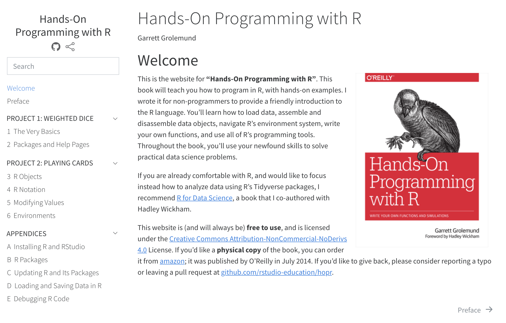
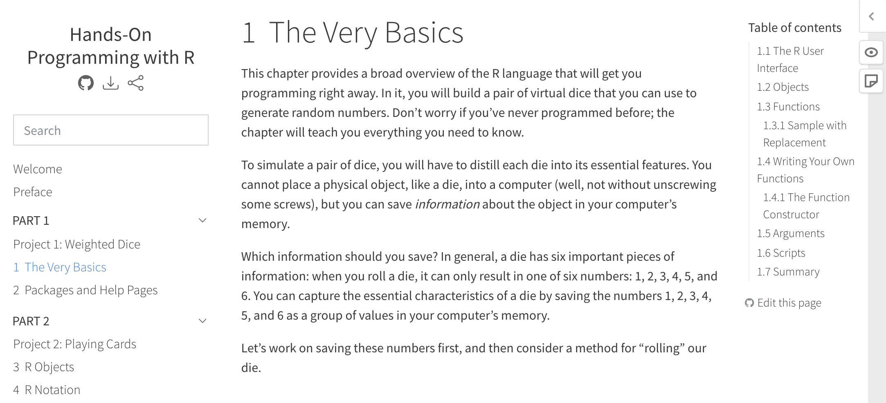
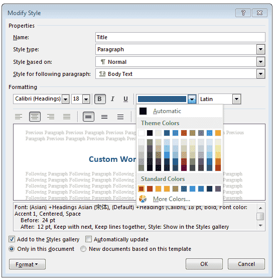

## Book Structure

The structure of a Quarto book can be as simple as a list of chapters, or can alternatively incorporate multiple parts and/or appendices. Quarto book chapters and sections are automatically numbered (for cross-referencing), however you can also specify that some parts of the book should remain unnumbered.

The simple book configuration generated by `quarto create-project` illustrates the basics:

``` {.yaml}
book:
  title: "mybook"
  author: "Jane Doe"
  date: "5/9/2021"
  chapters:
    - index.md
    - intro.md
    - summary.md
    - references.md
```

-   The index file is required and includes preface, acknowledgements, etc. Content in the index file is unnumbered.
-   The remainder of `chapters` includes one or more book chapters.
-   The `references.md` file will include the generated bibliography (see [References] below for details).

### Format Options

If you want to specify rendering options (including format-specific options), you do it within the `_quarto.yml` project file rather than within the individual markdown documents. For example:

``` {.yaml}
highlight-style: pygments
bibliography: references.bib
csl: citestyle.csl

format:
  html:
    theme: cosmo
    code-copy: true
```

This is because when rendering a book all of the chapters are combined together into a single document (with a single set of format options).

### Chapter Titles

Since rendering options are provided in `_quarto.yml`, you'll typically see a simple level-one header at the top of chapters. For example:

``` {.markdown}
# Introduction
```

As compared to typical Quarto documents where you'd see something like this:

``` {.yaml}
---
title: "Introduction"
---
```

::: {.callout-note}
Note that you will see the following YAML front matter in files generated by `quarto create-project`:

``` {.yaml}
---
knit: quarto render
---
```

This YAML metadata is provided per-file in order to instruct RStudio to use Quarto (as opposed to the `rmarkdown` package) to render the document. This metadata won't be required once RStudio can correctly recognize Quarto documents/projects.
:::

### Chapter Numbers

All chapters are numbered by default. If you want a chapter to be unnumbered simply add the `.unnumbered` class to it's main header. For example:

``` {.markdown}
# Resources {.unnumbered}
```

You can mix together numbered and unnumbered chapters. Note however that while you can link to unnumbered chapters, you can't [cross reference](crossref.md) figures, tables, etc. within them. Unnumbered chapters are therefore mostly useful for prefatory content or references at the end of your book.

### Section Numbers

You can set the numbering depth via the `number-depth` option. For example, to only number sections immediately below the chapter level, use this:

``` {.yaml}
number-depth: 1
```

Note that `toc-depth` is independent of `number-depth` (i.e. you can have unnumbered entries in the TOC if they are masked out from numbering by `number-depth`).

### Cover Images

You can provide a cover image for EPUB and/or HTML formats using the `cover-image` option. For example:

``` {.yaml}
book:
  cover-image: cover.png
```

You can also do this on a per-format basis (if for example you want to provide a higher resolution image for EPUB and a lower resolution image for HTML to reduce download time). For example:

``` {.yaml}
format:
   html: 
     cover-image: cover.png
   epub:
     cover-image: cover-highres.png
```

### References

You should include a `div` with the id `#refs` at the location in your book where you'd like the bibliography to be generated. For example the `references.md` file generated by `quarto create-project` includes this:

``` {.markdown}
# References {.unnumbered}

::: {#refs}
:::
```

Note that you can change the chapter title to whatever your like, remove `.unnumbered` to have it be numbered like other chapters, and add other content before or after the bibliography as necessary.

### Parts & Appendices

You can divide your book into parts using `part` within the book `chapters`. For example:

``` {.yaml}
chapters:
  - index.md
  - preface.md
  - part: dice.md
    chapters: 
      - basics.md
      - packages.md
  - part: cards.md
    chapters:
      - objects.md
      - notation.md
      - modifying.md
      - environments.md
```

Note that the markdown files `dice.md` and `cards.md` contain the part title (as a level one header) as well as some introductory content for the part. If you just need a part title then you can alternatively use this syntax:

``` {.yaml}
- part: "Dice"
  chapters: 
    - basics.md
    - packages.md
```

You can include appendices by adding an `appendices` key to your `book` config. For example:

``` {.yaml}
book:
  title: "mybook"
  author: "Jane Doe"
  date: "5/9/2021"
  chapters:
    - index.md
    - intro.md
    - summary.md
    - references.md
  appendices:
    - tools.md
    - resources.md
  
```

Parts and appendices show up like this in HTML output:

{.border}

In LaTeX output, the `\part` command is used for parts. In EPUB and MS Word output parts are ignored entirely.

Appendices are numbering using uppercase alpha, and have a prefix inserted into their title to indicate they are an appendix (e.g. "Appendix A --- Additional Resources"). You can customize the prefix and delimiter using the following options:

``` {.yaml}
crossref:
  appendix-title: "App."
  appendix-delim: ":"
```

Which would result in the above example being out out as: "App. A: Additional Resources".

## Reader Tools

### Sidebar Tools

Books automatically include a navigational sidebar that can optionally include tools for searching book contents, sharing links to the book, etc. Here is an example `_quarto.yml` file that enables these options:

``` {.yaml}
book:
  title: "Hands-On Programming with R"
  author: "Garrett Grolemund"
  search: true
  repo-url: https://github.com/jjallaire/hopr/
  repo-actions: [edit]
  downloads: [pdf, epub]
  sharing: [twitter, facebook]
  
comments:
  hypothesis: true
```

Note the various tools that now appear:

{.border}

-   The search box enables full text search of the entire book

-   The buttons immediately below the book title in the sidebar provide a link to the GitHub repo for the book, downloads for PDF and ePub versions of the book, and links for sharing the book on Twitter and Facebook.

-   Immediately below the table of contents on the right there is an "Edit this page" link that takes the reader to the edit interface on GitHub for the current chapter. Note that in this example we specify `repo-actions: [edit]`. You can optionally also add `issue` and `source` actions (e.g. `repo-actions: [edit, issue, source]`).

-   The [Hypothesis](https://web.hypothes.is/) commenting bar appears on the far right of the page. Note that [commenting](html-basics.Rmd#commenting) is a feature available for all Quarto HTML output so appears in it's own YAML key.

#### Sidebar Options

Note that books utilize the standard sidebar component from [Quarto Websites](websites.md). This means that you can use any of the available [sidebar options](website-navigation#side-navigation) within your `book` configuration. For example, here we specify a docked sidebar with a light background:

``` {.yaml}
book:
  title: "Hands-On Programming with R"
  author: "Garrett Grolemund"
  sidebar:
    style: docked
    background: light
```

### Footer Content

You can also use the `attribution` and `page-navigation` options to customize book chapter footer:

+-------------------+--------------------------------------------------------------------------------------------------------------+
| Option            | Description                                                                                                  |
+===================+==============================================================================================================+
| `attribution`     | Attribution text (e.g. copyright and/or creative commons license) to display at the bottom of book chapters. |
+-------------------+--------------------------------------------------------------------------------------------------------------+
| `page-navigation` | Provide navigation to previous and next book chapters (defaults to `true`).                                  |
+-------------------+--------------------------------------------------------------------------------------------------------------+

## Cross References

One important difference between creating a website and a book is that in addition to their web output, books are also rendered as a single contiguous document (e.g a PDF). Books also may or may not be read digitally (which means that internal hyperlinks may or may not be available).

To create books that are consumable in all of these mediums, special care should be taken when creating links to other chapters or sections within chapters (note though that if your book targets *only* HTML output you can feel free to use conventional hyperlinks).

Note that if you aren't already familiar with Quarto [Cross References](crossref.md) you may want to do so before reading on.

### Chapters and Sections

To make a chapter or section reference-able, you should add a `#sec` id to it's main heading. For example:

``` {.markdown}
# Introduction {#sec:introduction}
```

You can then refer to the chapter or section in one of two ways. To create a normal hyperlink, just use the `#sec` id:

``` {.markdown}
See the [Introduction](#sec:introduction)
```

However, if you expect that your book will be read in print, just providing the chapter name isn't all that helpful. Here you'll want to make a numeric reference (e.g. "see Chapter 4" or "see sec. 4.3"). To refer to a section, just include a cross-reference to it:

``` {.markdown}
See @sec:geospatial-analysis for additional discussion.
```

To refer to a chapter or appendix you should spell out "Chapter" or "Appendix" and use the number-only form of cross reference:

``` {.markdown}
See [Chapter -@sec:visualization] for more details on visualizing model diagnostics.
```

Note that normal Pandoc "heading links" (where no ID is specified, e.g. `[Introduction]`) will not work within books, you need to add an explicit ID to your sections to link to them.

### Chapter Numbering

In books, figures, tables and other cross-reference targets automatically include a chapter number. For example, the following markdown located in Chapter 3 of your book:

``` {.markdown}
As illustrated in @fig:geo-comparison, the western states have a much higher incidence of forest fires.
```

Might be rendered as:

> As illustrated in [fig. 3.2](#), the western states have a much higher incidence of forest fires.

Note that while books do support unnumbered chapters, you naturally cannot create cross-references to content in chapters without numbers.

### Section Numbers

By default, all headings in your document create a numbered section. You customize numbering depth using the `number-depth` option. For example, to only number sections immediately below the chapter level, use this:

``` {.yaml}
number-depth: 1
```

Note that `toc-depth` is independent of `number-depth` (i.e. you can have unnumbered entries in the TOC if they are masked out from numbering by `number-depth`).

## Code Execution

As with standalone Quarto documents, book chapters can be either plain markdown or use computational markdown (via knitr or Jupyter). However, if you have expensive computations in one or more of your chapters this can make the time required to render the entire book unacceptably long. Quarto has a few different tools you can use to overcome this problem.

### Incremental Render

When developing a book you are typically rendering only a single chapter to preview what it will look like. Quarto renders chapters incrementally, so for example if you are working on a PDF book and you render chapter 5, you'll still get a preview of the entire book but with only the chapter 5 changes (the other chapters automatically use previously rendered versions).

### Freezing

You can use the `freeze` option to denote that computational documents should never be re-rendered, or alternatively only be re-rendered when their source file changes:

``` {.yaml}
freeze: true  # never re-render
freeze: auto  # re-render only when source changes
```

Note that you'll still want to take care to fully re-render your book when things outside of source code change (e.g. input data). You can remove previously frozen output by deleting the `_freeze` folder at the root of your book project.

### Caching

You can use the `cache` option to cache the results of computations (using the [knitr cache](https://yihui.org/knitr/demo/cache/) for Rmd documents, and [Jupyter Cache](https://jupyter-cache.readthedocs.io/en/latest/) for .ipynb or Jupyter Markdown documents):

``` {.yaml}
cache: true
```

Note that cache invalidation is triggered by changes in chunk source code (or other cache attributes you've defined). You may however need to manually refresh the cache if you know that some other input (or even time) has changed sufficiently to warrant an update. To do this, render either individual files or an entire project using the `--cache-refresh` option:

``` {.bash}
$ quarto render mydoc.Rmd --cache-refresh # single doc
$ quarto render --cache-refresh           # entire project
```

### No Execute

Finally, if you are using Jupyter Notebooks as inputs, you may prefer to execute all code within interactive notebook sessions, and *never* have Quarto execute the code cells:

``` {.yaml .yml}
execute: false
```

You can specify this option either globally or per-notebook.

## Book Output

### Location

By default, book output is written to the `_book` directory of your project. You can change this via the `output-dir` project option. For example:

``` {.yaml}
project:
  type: book
  output-dir: docs
```

Single file outputs like PDF, EPUB, etc. are also written to the `output-dir`. Their file name is derived from the book `title`. You can change this via the `output-file` option:

``` {.yaml}
book:
  title: "My Book"
  output-file: "my-book"
```

Note that the `output-file` should *not* have a file extension (that will be provided automatically as appropriate for each format).

### LaTeX Output

In some cases you'll want to do customization of the LaTeX output before creating the final printed manuscript (e.g. to affect how text flows between pages or within and around figures). The best way to approach this is to develop your book all the way to completion, then render with the `keep-tex` option:

``` {.yaml}
format:
  pdf:
    keep-tex: true
```

The complete LaTeX source code of your book will be output into the main book source directory (e.g. to "my-book.tex"). This LaTeX can be compiled without Quarto, so is suitable for submitting to an external publisher.

At this point you should probably make a copy of the book directory to perform your final LaTeX modifications within (since the modifications you make to LaTeX will not be preserved in your markdown source, and will therefore be overwritten the next time you render).

## Custom Styles

While the default book output is reasonably attractive for all formats, you may want to provide additional customization.

### HTML

HTML output can be customized either by adding (or enhancing) a custom theme, or by providing an ordinary CSS file. Use the `theme` option to specify a theme:

``` {.yaml}
format:
  html:
    theme: cosmo
```

To further customize a theme add a custom theme file:

``` {.yaml}
format:
  html:
    theme: [cosmo, theme.scss]
```

You can learn more about creating theme files in the documentation on [HTML Themes](html-themes.md).

You can also just use plain CSS. For example:

``` {.yaml}
format:
  html:
    css: styles.css
```

### EPUB

You can also use CSS to customize EPUB output:

``` {.yaml}
format:
  epub:
    css: epub-styles.css
    epub-cover-image: epub-cover.png
```

Note that we also specify a cover image. To learn more about other EPUB options, see the Pandoc [documentation on EPUBs](https://pandoc.org/MANUAL.html#epubs).

### PDF / LaTeX

You can include additional LaTeX directives in the preamble of your book using the `include-in-header` option. You can also add `documentclass` and other options (see the Pandoc documentation on [LaTeX options](https://pandoc.org/MANUAL.html#variables-for-latex) for additional details). For example:

``` {.yaml}
format:
  pdf: 
    documentclass: book
    include-in-header: preamble.tex
    fontfamily: libertinus
```

Note that Quarto books use `documentclass: report` by default. You can switch to `book` as demonstrated above. You can find a summary of the differences between `book` and `report` here: <https://tex.stackexchange.com/questions/36988>

### MS Word

You can customize MS Word output by creating a new [reference doc](https://pandoc.org/MANUAL.html#option--reference-doc), and then applying it to your book as follows:

``` {.yaml}
format:
  docx:
    reference-doc: custom-reference.docx
```

To create a new reference doc based on the Pandoc default, execute the following command:

``` {.bash}
$ pandoc -o custom-reference.docx --print-default-data-file reference.docx
```

Then, open `custom-reference.docx` in MS Word and modify styles as you wish:


When you move the cursor to a specific element in the document, an item in the styles list will be highlighted. If you want to modify the style of any type of element, you can click the drop-down menu on the highlighted item, and you will see a dialog box like this:



After you finish modifying the styles, you can save the document and use it as the template for future Word documents.
