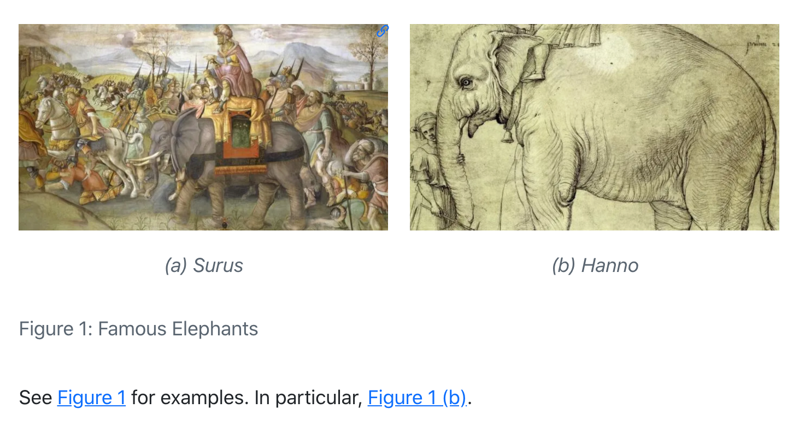
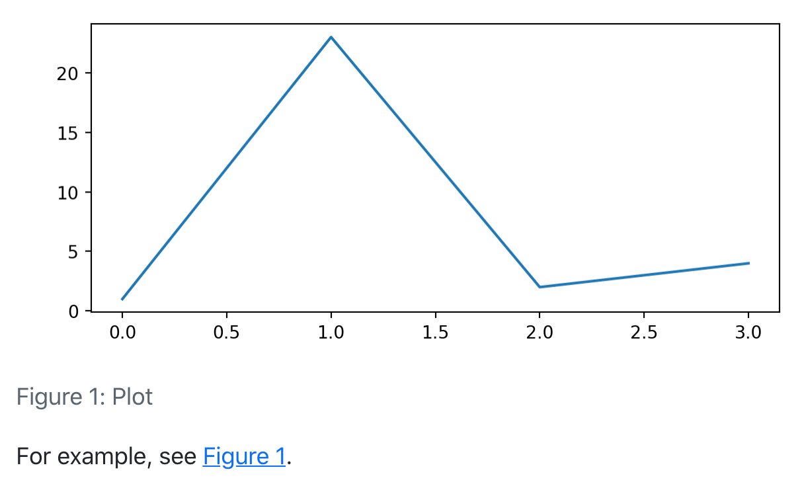
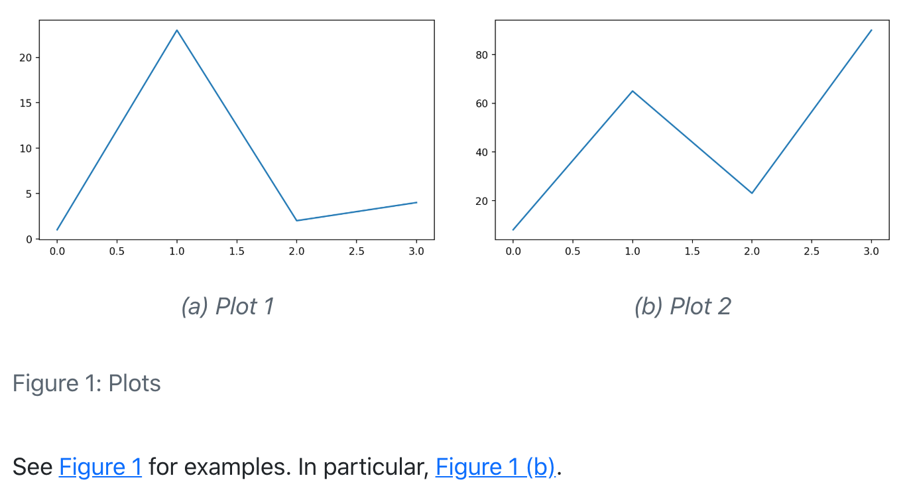
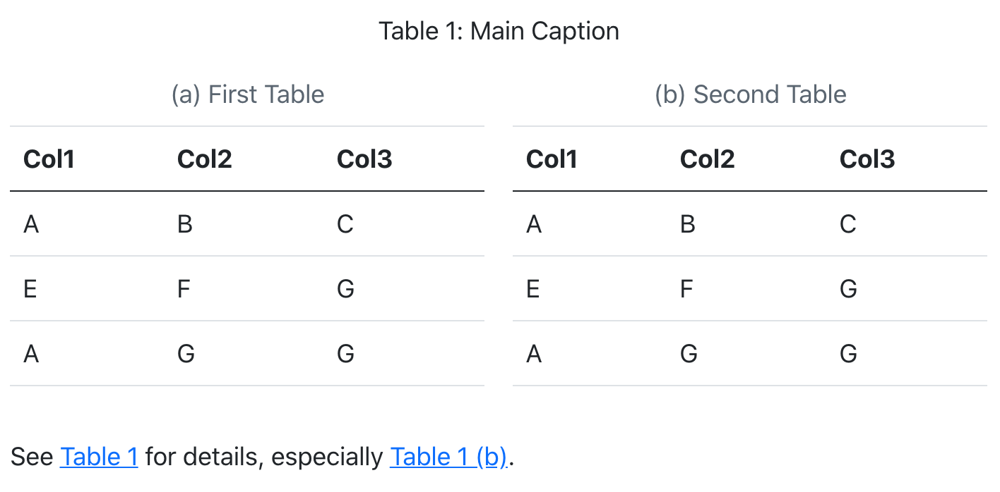
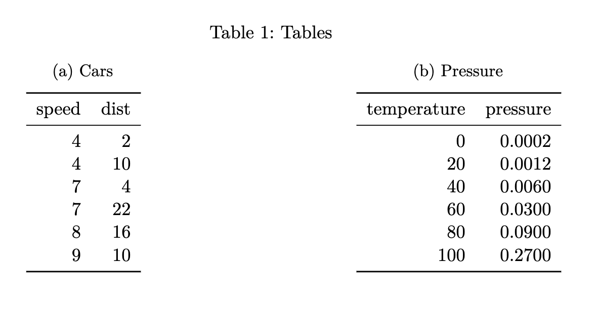
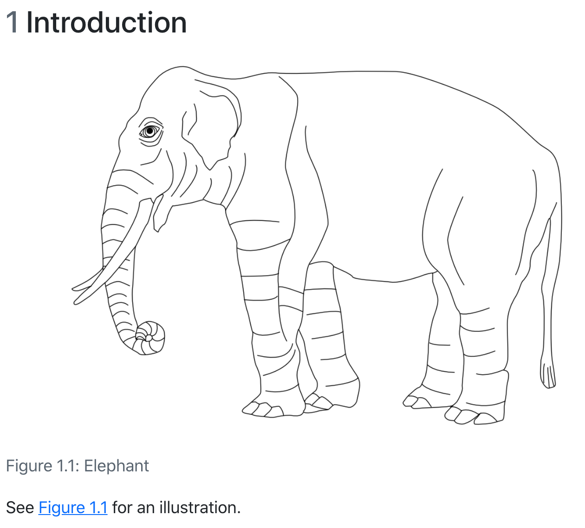

## Overview

Cross-references make it easier for readers to navigate your document by providing numbered references and hyperlinks to various entities like figures and tables. Every cross-referenceable entity requires a label (unique identifier) and caption (description). For example, this is a cross-referenceable figure:

``` markdown
{#fig-elephant}
```

The presence of the caption (`Elephant`) and label (`#fig-elephant`) make this figure referenceable. This enables you to use the following syntax to refer to it elsewhere in the document:

``` markdown
See @fig-elephant for an illustration.
```

Here is what this would look like rendered to HTML:


Quarto enables you to create cross-references to figures, tables, equations, sections, code listings, theorems, proofs, and more. Cross references can also be applied to dynamic output from knitr and Jupyter. The inline reference text ("fig. 1" in the above example) can also be customized (e.g. "figure 1" rather than the abbreviation).

::: {.callout-note style="padding-bottom: 16px"}
Quarto's syntax for cross-references is based on [pandoc-crossref](https://github.com/lierdakil/pandoc-crossref) (which is in turn based on this discussion: <https://github.com/jgm/pandoc/issues/813>). There are however several differences (mostly related to handling computational output) to note:

1.  Quarto uses the prefix `#fig-` rather than `#fig:` (which is more compatible with Jupyter notebook [cell ids](https://jupyter.org/enhancement-proposals/62-cell-id/cell-id.html)).
2.  Quarto is able to reference raw HTML and LaTeX figures and tables (which are often produced by executable code blocks).
3.  Quarto has support for referencing theorems and proofs (and related types).
:::

## Figures

As described above, this is the markdown used to create a cross-referenceable figure and then refer to it:

``` markdown
{#fig-elephant}

See @fig-elephant for an illustration.
```

### Subfigures

You may want to create a figure composed of multiple subfigures. To do this, enclose the figures in a div (with it's own label and caption) and give each subfigure it's own label and caption. You can then refer to either the entire figure in a reference or a single subfigure:

``` markdown
::: {#fig-elephants layout.ncol=2}

{#fig-surus}

{#fig-hanno}

Famous Elephants
:::

See @fig-elephants for examples. In particular, @fig-hanno.
```

Here is what this looks like when rendered as HTML:

{.preview-image}

Note that we also used the `layout.ncol` attribute to specify a two-column layout. See the article on [Figures and Layout](figures-and-layout.html) for more details on laying out panels of figures.

### Computations

Figures produced by Jupyter and Knitr can also be cross-referenced. To do this, add a `label` and `fig.cap` option at the top of the code block. For example:

::: panel-tabset
#### Jupyter

```` python
```{python}
#| label: fig-plot
#| fig.cap: "Plot"

import matplotlib.pyplot as plt
plt.plot([1,23,2,4])
plt.show()
```

For example, see @fig-plot.
````



#### Knitr

```` python
```{r}
#| label: fig-plot
#| fig.cap: "Plot"

plot(cars)
```

For example, see @fig-plot.
````


:::

You can also create multiple figures within a Jupyter code cell and reference them as subfigures. To do this use `fig.cap` for the main caption, and `fig.subcap` to provide an array of subcaptions. For example:

```` python
```{python}
#| label: fig-plots
#| fig.cap: "Plots" 
#| fig.subcap:
#|   - "Plot 1"
#|   - "Plot 2" 
#| layout.ncol: 2

import matplotlib.pyplot as plt
plt.plot([1,23,2,4])
plt.show()

plt.plot([8,65,23,90])
plt.show()
```

See @fig-plots for examples. In particular, @fig-plots-2.
````



Note that subfigure reference labels are created automatically based on the main chunk label (e.g. `@fig-plots-1`, `@fig-plots-2`, etc.).

## Tables

To create a cross-referenceable table, add a caption to the table then include a `#tbl-` label in braces at the end of the caption. For example:

``` markdown
| Col1 | Col2 | Col3 |
|------|------|------|
| A    | B    | C    |
| E    | F    | G    |
| A    | G    | G    |

: My Caption {#tbl-letters}

See @tbl-letters.
```


You may want to create a composition of several sub-tables. To do this, create a div with a main identifier, then apply sub-identifiers within the caption of contained tables. For example:

``` markdown
::: {#tbl-panel layout.ncol=2}
| Col1 | Col2 | Col3 |
|------|------|------|
| A    | B    | C    |
| E    | F    | G    |
| A    | G    | G    |

: First Table {#tbl-first}

| Col1 | Col2 | Col3 |
|------|------|------|
| A    | B    | C    |
| E    | F    | G    |
| A    | G    | G    |

: Second Table {#tbl-second}

Main Caption
:::

See @tbl-panel for details, especially @tbl-second.
```



Note that the "Main Caption" for the table is provided as the last block within the containing div.

### Computations

You can also cross-reference tables created from code executed via Knitr or Jupyter. To do this, add a `tbl.cap` attribute and include `#tbl-` labels within the captions of the sub-tables. For example:

```` python
```{r}
#| label: tbl-tables
#| tbl.cap: "Tables"
#| layout.ncol: 2

library(knitr)
kable(head(cars), caption = "Cars {#tbl-cars}")
kable(head(pressure), caption = "Pressure {#tbl-pressure}")
```
````



## Equations

Provide an `#eq-` label immediately after an equation to make it referenceable. For example:

``` markdown
Black-Scholes (@eq-black-scholes) is a mathematical model that seeks to explain the behavior of financial derivatives, most commonly options:

$$
\frac{\partial \mathrm C}{ \partial \mathrm t } + \frac{1}{2}\sigma^{2} \mathrm S^{2}
\frac{\partial^{2} \mathrm C}{\partial \mathrm C^2}
  + \mathrm r \mathrm S \frac{\partial \mathrm C}{\partial \mathrm S}\ =
  \mathrm r \mathrm C 
$$ {#eq-black-scholes}
```


Note that the equation number is included (via `\qquad`) in the right margin of the equation.

## Sections

To reference a section, add a `#sec-` identifier to any heading. For example:

``` markdown
## Introduction {#sec-introduction}

See @sec-introduction for additional context.
```

Note that when using section cross-references, you will also need to enable the `number-sections` option (so that section numbering is visible to readers). For example:

``` yaml
---
title: "My Document"
number-sections: true
---
```

## Code Listings

To create a reference-able code block, add a `#lst-` identifier along with a `lst.cap` attribute. For example:

```` markdown
```{#lst-customers .sql lst.cap="Customers Query"}
SELECT * FROM Customers
```

Then we query the customers database (@lst-customers).
````

## Theorems and Proofs

Theorems are commonly used in articles and books in mathematics. To include a reference-able theorem, create a div with a `#thm-` label (or one of other theorem-type labels described below). You also need to specify a theorem name either via the first heading in the block. You can include any content you like within the div. For example:

``` markdown
::: {#thm-line}
## Line

The equation of any straight line, called a linear equation, can be written as:

$$
y = mx + b
$$
:::

See @thm-line.
```


For LaTeX output, the [amsthm](https://ctan.org/pkg/amsthm?lang=en) package is used for typesetting theorems. For other formats an appropriate treatment is used (the above is an example of HTML output).

There are a number of theorem variations supported, each with their own label prefix:

| **Label Prefix** | **Printed Name** | **LaTeX Environment** |
|------------------|------------------|-----------------------|
| `#thm-`          | Theorem          | theorem               |
| `#lem-`          | Lemma            | lemma                 |
| `#cor-`          | Corollary        | corollary             |
| `#prp-`          | Proposition      | proposition           |
| `#cnj-`          | Conjecture       | conjecture            |
| `#def-`          | Definition       | definition            |
| `#exm-`          | Example          | example               |
| `#exr-`          | Exercise         | exercise              |

The `proof`, `remark`, and `solution` environments generally receive similar typesetting as theorems, however they are not numbered (and therefore cannot be cross-referenced). To create these environments just use them as the class name of a div:

``` markdown
::: {.solution}
The solution.
:::
```

As with theorems you can optionally include a heading as the first element of the div (or a `name` attribute) to give the environment a caption for typesetting (this typically appears in parentheses after the environment title).

For LaTeX output the [amsthm](https://ctan.org/pkg/amsthm?lang=en) package is used to typeset these environments. For other formats a similar treatment is used, but you can further customizing this using CSS.

## References

The examples above have all used the default syntax for inline references (e.g. `@fig-elephant`), which results in the use a short abbreviation for each object type (e.g. "fig. 1", "tbl. 1", etc.).

You can customize the appearance of inline references by either changing the syntax of the inline reference or by setting options. Here are the various ways to compose a cross-reference and their resulting output:

| Type          | Syntax                   | Output   |
|---------------|--------------------------|----------|
| Default       | `@fig-elephant`          | fig. 1   |
| Capitalized   | `@Fig-elephant`          | Fig. 1   |
| Custom Prefix | `[Figure @fig-elephant]` | Figure 1 |
| No Prefix     | `[-@fig-elephant]`       | 1        |

You can also group cross references using the following syntax:

``` markdown
As illustrated in [@fig-elephant; @fig-panther; @fig-rabbit].
```

There are a number of options that can be used to further customize the treatment of cross-references. See the section below on [References Options](#references-1) for additional details.

## Chapter Numbering

You can use the `crossref: chapters` option to indicate that top-level headings (H1) in your document correspond to chapters, and that cross-references should be sub-numbered by chapter. For example:

``` markdown
---
title: "My Document"
author: "Jane Doe"
crossref:
  chapters: true
---

# Introduction

{#fig-elephant}

See @fig-elephant for an illustration.
```



## Lists

For LaTeX / PDF output, you can use the raw LaTeX commands `\listoffigures`, `\listoftables` and `\listoflistings` to produce listings of all figures, tables, etc. within a document. You can use the `lof-title`, `lot-title`, and `lol-title` crossref options to customize the title of the listing.

For example:

``` markdown
---
title: "My Document"
crossref:
  lof-title: "List of Figures"
format: pdf
---

\listoffigures
```

Note that the default titles for the lists use the form displayed above (i.e. "List of...\<Type>").

## Options

There are a wide variety of options available for customizing caption labels and references. These options are all specified within the `crossref` key of document metadata.

### Titles

You can specify the title prefix used for captions using `*-title` options. You can also specify the delimiter used between the prefix and the caption using the `title-delim` option. For example:

``` yaml
---
title: "My Document"
crossref:
  fig-title: Fig     # (default is "Figure")
  tbl-title: Tbl     # (default is "Table")
  title-delim: —     # (default is ":")
---
```

### References {#references-1}

You can specify the prefix used for inline reference type using `*-prefix` options. You can also specify whether references should be hyper-linked using the `ref-hyperlink` option. For example:

``` yaml
---
title: "My Document"
crossref:
  fig-prefix: figure   # (default is "fig.")
  tbl-prefix: table    # (default is "tbl.")
  ref-hyperlink: false # (default is true)
---
```

### Numbering

There are a variety of numbering schemes available for cross-references, including:

-   `arabic` (1, 2, 3)

-   `roman` (I, II, III, IV)

-   `roman i` (i, ii, iii, iv)

-   `alpha x` (start from letter 'x')

-   `alpha X` (start from letter 'X')

You can specify the number scheme used for all types (other than sub-references) using the `labels` option. For sub-references (e.g. subfigures), you can specify the number scheme using the `subref-labels` option. For example:

``` yaml
---
title: "My Document"
crossref:
  labels: alpha a        # (default is arabic)
  subref-labels: roman i # (default is alpha a)
---
```

If you would like, you can specify the number scheme for a specific type using the `*-labels` options. For example:

``` yaml
---
title: "My Document"
crossref:
  fig-labels: alpha a    # (default is arabic)
  tbl-labels: alpha a    # (default is arabic)
  subref-labels: roman i # (default is alpha a)
---
```

If both `labels` and a type specific label option is provided, the type specific option will override the `labels` option.
