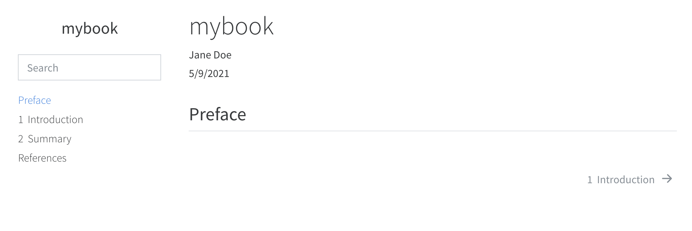
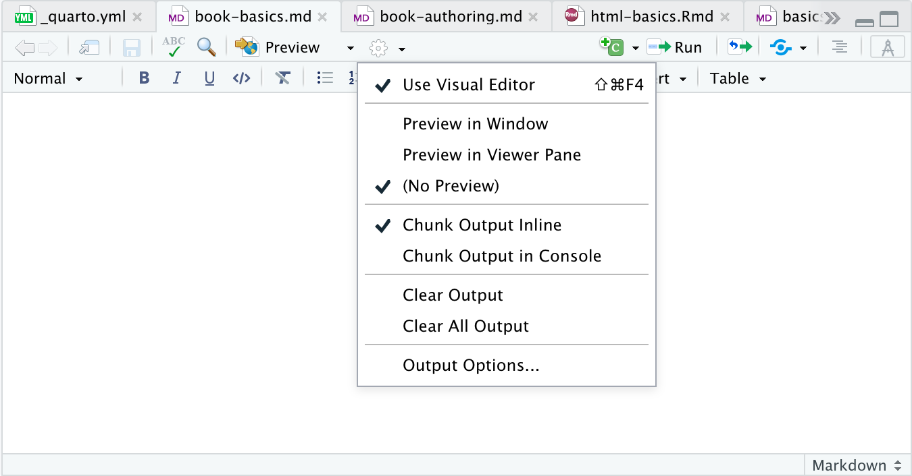

## Overview

Quarto Books are combinations of multiple documents (chapters) into a single manuscript. Books can be created in a variety of formats:

-   PDF
-   HTML
-   EPUB
-   MS Word

HTML books are not that different from [Quarto Websites](website-basics.md) save for the fact that chapters and sections are numbered and therefore support [Cross References](crossref.md).

Here are some examples of books created with Quarto:

-   [Hands on Programming with R](https://jjallaire.github.io/hopr/)
-   [Visualization Curriculum](https://jjallaire.github.io/visualization-curriculum)

## Getting Started

To create a new book project, use the Quarto `create-project` command:

``` {.bash}
$ quarto create-project mybook --type book
```

This will create the scaffolding for a simple book in the `mybook` subdirectory. To build and view the HTML version of the book use the `serve` command:

``` {.bash}
$ quarto serve mybook
```

This will build the HTML version of the book and run a local web server to view it. Here's what you'll see in your browser for the simple book scaffolding:

{.border}

The book's chapters are contained in the files `index.md`, `introduction.md`, `summary.md`. Try adding some content to one of these files and saving---you'll notice that the book preview is automatically updated in the browser.

You'll also notice that a Quarto project file (`_quarto.yml`) was created in the `mybook` directory. This file contains the initial configuration for your book:

``` {.yaml}
project:
  type: book

book:
  title: "mybook"
  author: "Jane Doe"
  date: "5/11/2021"
  chapters:
    - index.qmd
    - intro.qmd
    - summary.qmd
    - references.qmd

bibliography: references.bib

format:
  html:
    theme: cosmo
  pdf:
    documentclass: report
  epub:
    epub-cover-image: cover.png
```

## Workflow

### Development

When working on a book, you'll typically run the local development server as described above and incrementally preview content as you work:

``` {.bash}
$ quarto serve
```

If you have a plain markdown file (with no computations), then saving it will cause the preview to automatically update (as will changes to config files, CSS files, etc.). If you are working on a file with computations (e.g. an Rmd or Jupyter notebook) then you need to explicitly re-render it to update the preview.

Note that development server updates do not cause an update to the final book output. Consequently, you should always `quarto render` your site before deploying it as described below in [Publishing].

### RStudio

Note that if you are using Quarto within RStudio, you can run the development server within the RStudio Viewer pane using the **quarto** R package:

``` {.r}
library(quarto)
quarto_serve()
```

Note that you should also be sure to disable the standard RStudio preview behavior when using this workflow:



Note that the **(No Preview)** option is checked to disable the normal preview on render behavior.

RStudio v1.4 automatically uses Quarto to render Rmd documents whenever it sees a `format` key in the YAML front matter (as opposed to an `output` key). For projects, you typically provide the `format` configuration in `_quarto.yml` so may not have a `format` key in individual documents.

However, since RStudio v1.4 is not aware of Quarto projects, you should add an explicit entry in YAML front-matter to ensure that Quarto (rather than the **rmarkdown** package) is used for rendering:

``` {.yaml}
---
title: "My Page"
knit: quarto render
---
```

### Publishing

When you are ready to publish the book, use the `render` command to render all output formats:

``` {.bash}
$ quarto render --to all
```

If you pass no arguments to `quarto render` the default format (HTML) will be rendered. You can also render individual formats via the `--to` argument:

``` {.bash}
$ quarto render           # render default format (HTML)
$ quarto render --to pdf  # render PDF format only
```

The output of your book will be written to the `_book` sub-directory of your book project:

``` {.yaml}
mybook/
  _book/
    index.html # and other website files
    mybook.pdf
    mybook.epub
```

See the documentation on [Publishing Websites](../websites/publishing-websites.md) for details on how to publish books to GitHub Pages, Netlify, and other services. Note that in that documentation the `output-dir` may be referred to as `_site`: for publishing books you should use `_book` rather than `_site`.

## Learning More

Once you are familiar with the basic mechanics, read the article on [Book Authoring](book-authoring.md) to learn about:

-   How to structure your book (numbered and unnumbered chapters/sections, creating multiple parts, adding appendices, etc.)

-   Incorporating computational output from knitr or Jupyter (including tools for caching the results of longer running chapters/sections).

-   Creating cross-references to chapters, sections, figures, tables, etc.

-   Customizing the style and appearance of your book in the various output formats.

-   Providing navigation and other tools for readers (e.g. download other formats, share on twitter, suggest changes, etc.)
