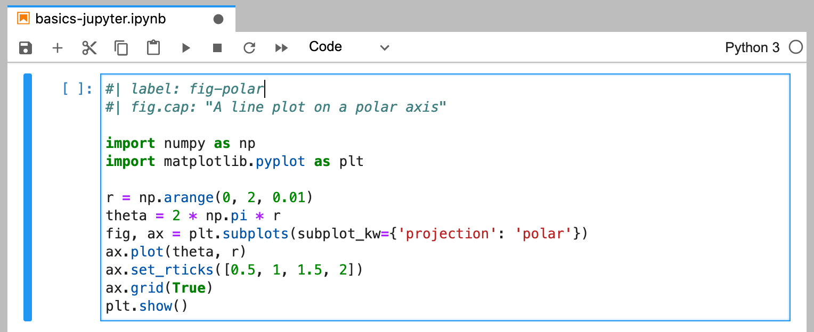

## Overview

Quarto can render Jupyter notebooks represented as plain text (.md) or as a normal notebook file (.ipynb). One benefit of using .ipynb is that you can use [JupyterLab](https://jupyterlab.readthedocs.io/en/stable/) as your editor.

Here is the "Hello, Quarto" example from the homepage inside JupyterLab:

{.border}

There are a few things to point out about this notebook:

-   The first cell contains document level options in a YAML front matter block.

-   The markdown cell immediately below uses the Quarto markdown cross-reference syntax (`@fig-polar`) to refer to the figure below.

-   There are a couple of comment lines at the top of the code cell providing output options.

We'll describe each of these in more depth below. First though, let's render the notebook to HTML with Quarto:

``` {.bash}
$ quarto render basics-jupyter.ipynb
```

{.border}

By default, all code cells are re-run in order by Quarto, and their output is included in the final document generated by Pandoc. You can also choose to not re-run the cells and use previously computed outputs (see [Rendering Options] below for details).

## YAML Front Matter

The first cell of your notebook should be a **Raw** cell that contains the document title, author, and any other options you need to specify. Note that you can switch the type of a call to **Raw** using the notebook toolbar:

{.border}

In this example we specify that we want code to appear collapsed by default. There are YAML options to control many other aspects of document rendering. See the documentation on [Authoring](../authoring/document-options.md) and [Output Formats](../docs/output-formats/html-basics.md) for additional details.

## Markdown Cells

Here's the underlying code for the markdown cell:

{.border}

Note that a Quarto cross-reference (`@fig-polar`) is included in the markdown. Any valid Pandoc markdown syntax can be included in markdown cells.

## Cell Output Options

Quarto uses leading comments with a special prefix (`#|`) to denote cell options. Here we specify the `label` and `fig.cap` options so that the plot generated from the cell can be cross-referenced.



Note that options must appear at the very beginning of the cell. As with document front-matter, option names/values use YAML syntax.

There are many output options available, including options to optionally hide code, warnings, and/or output. See the documentation on [Output Outputs](../computations/executing-code.md) for additional details.

## Rendering Options

By default, all code cells are re-run in order by Quarto during rendering. You may however prefer to only execute cells in the notebook, and have Quarto just render the notebook without any execution. Specify the `execute: false` option in YAML front matter to prevent execution:


You can also specify this on the command line as follows:

``` {.bash}
$ quarto render basics-jupyter.ipynb --no-execute
```

There are many other execution options available (e.g. to control caching, optimizing kernel startup time, etc.). Learn more about these options in [Execution Options](executing-code.md#execution-options).

## Plain Text Notebooks
