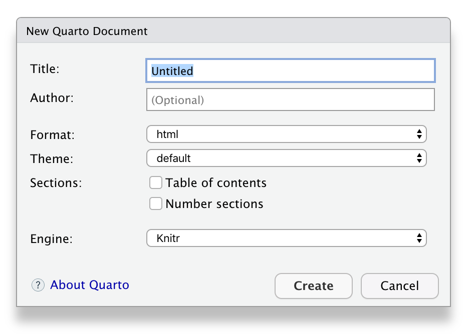

## Overview

RStudio IDE [v1.5.184](https://dailies.rstudio.com) or higher includes support for editing and preview of Quarto documents. This works for plain markdown as well as both the Knitr and Jupyter engines.

The version of RStudio that works with Quarto (v1.5) is currently available as a daily build. If you are using Quarto within RStudio it is **strongly** recommended that you use this version (the documentation below assumes you are using this build).

You can download the RStudio daily build from <https://dailies.rstudio.com>.

#### Creating a Document

Use the **File :** **New File : Quarto Doc...** command to create new Quarto documents:

{width="471"}


## Knitr Engine

Quarto is designed to be highly compatible with existing [R Markdown](https://rmarkdown.rstudio.com/) documents. You should generally be able to use Quarto to render any existing Rmd document without changes.

One important difference between R Markdown documents and Quarto documents is that in Quarto chunk options are typically included in special comments at the top of code chunks rather than within the line that begins the chunk. For example:

```` {.python}
```{r}
#| echo: false
#| fig.cap: "Air Quality"

library(ggplot2)
ggplot(airquality, aes(Temp, Ozone)) + 
        geom_point() + 
        geom_smooth(method = "loess", se = FALSE)
```
````

Quarto uses this approach to both better accommodate longer options like `fig.cap`, `fig.subcap`, and `fig.alt` as well as to make it straightforward to edit chunk options within more structured editors that don't have an easy way to edit chunk metadata (e.g. most traditional notebook UIs).

::: {.callout-note}
Note that if you prefer it is still possible to include chunk options on the first line (e.g. ```` ```{r, echo = FALSE} ````). That said, we recommend using the comment-based syntax to make documents more portable and consistent across execution engines.
:::

Chunk options included this way use YAML syntax rather than R syntax for consistency with options provided in YAML front matter. You can still however use R code for option values by prefacing them with `!expr`. For example:

``` {.r}
#| fig.cap: !expr paste("Air", "Quality")
```

## Jupyter Engine

You can also work with Quarto markdown documents that target the Jupyter engine within RStudio. These files will typically include a `jupyter` option in the YAML front matter indicating which kernel to use. For example:

``` {.yaml}
---
title: "Matplotlib Demo"
author: "Norah Smith"
jupyter: python3
---
```

If you want to work within a virtual environment ([venv](https://packaging.python.org/guides/installing-using-pip-and-virtual-environments/#creating-a-virtual-environment)), use the **File :** **New Project...** command and specify which packages you'd like to seed the venv with: 

{width="552"}

RStudio will automatically activate this virtual environment whenever you open the project. You can install additional Python packages into the environment using the RStudio **Terminal** tab. For example:

{width="726"}

## R Package

If you are not using RStudio and/or you prefer to render from the R console, you can do so using the **quarto** R package. To install the R package:

``` {.r}
remotes::install_github("quarto-dev/quarto-r")
```

Then, to render a document:

``` {.r}
library(quarto)
quarto_render("document.qmd")
```

If you working on a [website](../websites/website-basics.md) or [book](../books/book-basics.md) project, you can run the Quarto development server with:

``` {.r}
library(quarto)
quarto_serve()
```
