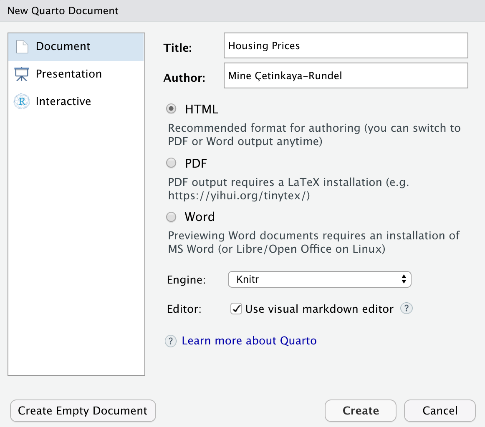

### Overview

In this tutorial we'll show you how to author Quarto documents in RStudio.
In particular, we'll discuss the various document formats you can produce with the same source code and show you how to add components like table of contents, equations, citations, etc.
The [visual markdown editor](/docs/visual-editor/) in RStudio makes many of these tasks easier so we'll highlight its use in this tutorial, but note that it's possible to accomplish these tasks in the source editor as well.

### Output formats

Quarto supports rendering notebooks to dozens of different output formats.
By default, the `html` format is used, but you can specify an alternate format (or formats) within document options.

#### Format Options

You can choose the format you want to render your Quarto document to at the time of creating your new document.
By default, RStudio suggests using HTML as the output.

{fig-alt="Create a new document menu in the RStudio IDE" fig-align="center" width="600"}

Once your document is created, you will see that this choice is not even reflected in the YAML as it is the default output format for Quarto documents.

``` yaml
---
title: "Housing Prices"
author: "Mine Çetinkaya-Rundel"
---
```

However you can directly edit the YAML to change the output format, e.g., to PDF (`pdf`) or MS Word (`docx`).

``` yaml
---
title: "Housing Prices"
author: "Mine Çetinkaya-Rundel"
format: pdf
---
```

You can also add options for the format you specify, e.g., create a table of contents (`toc: true`) or number sections (`number-sections: true`).

``` yaml
---
title: "Housing Prices"
author: "Mine Çetinkaya-Rundel"
format:
  pdf:
    toc: true
    number-sections: true
---
```

### Multiple formats

Some documents you create will have only a single output format, however in many cases it will be desirable to support multiple formats.
Let's add the `html` and `docx` formats to our document and modify some options specific to each format:

``` yaml
---
title: "Housing Prices"
author: "Mine Çetinkaya-Rundel"
toc: true
number-sections: true
highlight-style: pygments
format:
  html: 
    code-fold: true
    html-math-method: katex
  pdf:
    geometry: 
      - top=30mm
      - left=30mm
  docx: default
---
```

There's a lot to take in here!
Let's break it down a bit.
The first two lines are generic document metadata that aren't related to output formats at all:

``` yaml
---
title: "Housing Prices"
author: "Mine Çetinkaya-Rundel"
---
```

The next three lines are document format options that *apply to all formats* (which is why they are specified at the root level):

``` yaml
---
toc: true
number-sections: true
highlight-style: pygments
---
```

Next, we have the `format` option, where we provide format-specific options:

``` yaml
---
format:
  html: 
    code-fold: true
    html-math-method: katex
  pdf:
    geometry: 
      - top=30mm
      - left=30mm
  docx: default
---
```

The `html` and `pdf` formats each provide an option or two (its not important at this point to understand what those options do, although you can probably guess from their names).
The `docx` format is a bit different---it specifies `docx: default`.
This indicates that we just want to use all of the default options for the format.

### Rendering

Clicking the <kbd>{width="25" height="21"}<kbd> Render button in RStudio will render the document to the first format listed in the YAML.
If you would like to render to all formats, you can do so with

``` r
quarto_render("housing-prices.qmd", output_format = c("pdf", "html", "docx"))
```

Once your document is rendered, you can publish on Rpubs, or ghpages or look at other options at https://quarto.org/docs/output-formats/html-publishing.html.

::: callout-note
TO DO: reformat this sentence.
:::

Want to give it a try?
Download the following `.qmd` file, open it in RStudio, and click on {width="25" height="20"} **Render** to get started.

::: {.callout-note appearance="minimal"}
<i class="bi bi-journal-code"></i> [Download housing-prices.qmd](_housing-prices.qmd){download="housing-prices.qmd"}
:::

------------------------------------------------------------------------

-   In pdf, `documentclass`, `geometry`, `colorlinks`
-   Also can do presentations! Link to presentations on the guide.

### Table of contents

https://quarto.org/docs/output-formats/html-basics.html#table-of-contents and https://quarto.org/docs/output-formats/pdf-basics.html#table-of-contents -- show the yaml is pretty much the same

### Section numbering

https://quarto.org/docs/output-formats/pdf-basics.html#section-numbering

### Equations

Basically first screenshot from https://quarto.org/docs/visual-editor/technical.html#equations but in qmd

### Citations

Screenshot / GIF: Show insert citation from DOI using the visual editor

Mention it creates bib for you and adds to it

Mention can link Zotero etc.

Link to https://quarto.org/docs/authoring/footnotes-and-citations.html#citations

### Cross references

Screenshot: Add cross reference with visual editor

Maybe: customization of how it shows up, with equation as example

Link to https://quarto.org/docs/authoring/cross-references.html

### Article layout

https://quarto.org/docs/authoring/article-layout.html

-   tabsets
