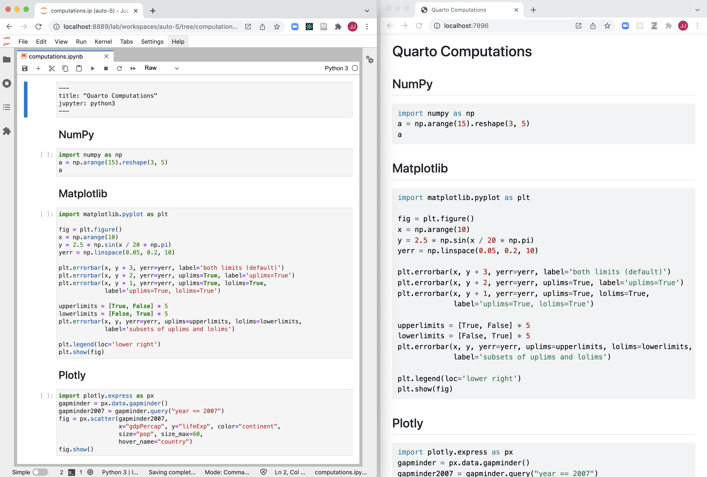

### Overview

Quarto has a wide variety of options available for controlling how code and computational output appear within rendered documents. In this tutorial we'll take a simple notebook that has some numeric output and plots and cover how to apply these options.

If you want to follow along step-by-step in your own environment, download this notebook:

::: {.callout-note appearance="minimal"}
<i class="bi bi-journal-code"></i> [Download computations.ipynb](_computations.ipynb){download="computations.ipynb"}
:::

Now, make sure you are in the directory containing `computations.ipynb`, then issue this command to open Jupyter Lab and start working with the notebook:

+-----------------+------------------------------------------------+
| Platform        | Command                                        |
+=================+================================================+
| Mac/Linux       |     python3 -m jupyter lab computations.ipynb  |
+-----------------+------------------------------------------------+
| Windows         |     py -m jupyter lab computations.ipynb       |
+-----------------+------------------------------------------------+

Here's the notebook as we start out (note that none of the cells are executed yet):

{.border .column-body-outset-right}

Create a new Terminal within Jupyter Lab that you'll use for Quarto commands:

{.border .column-body-outset-right}

Finally, run `quarto preview` in the terminal and position Jupyter Lab side-by-side with the browser showing the preview:

``` bash
quarto preview computations.ipynb
```

{.border .column-body-outset-right}

### Controlling output

(echo, warning, include, error)

### Code blocks

(folding, etc.)

### Figures

(size, caption)

### Inline code

### Caching
