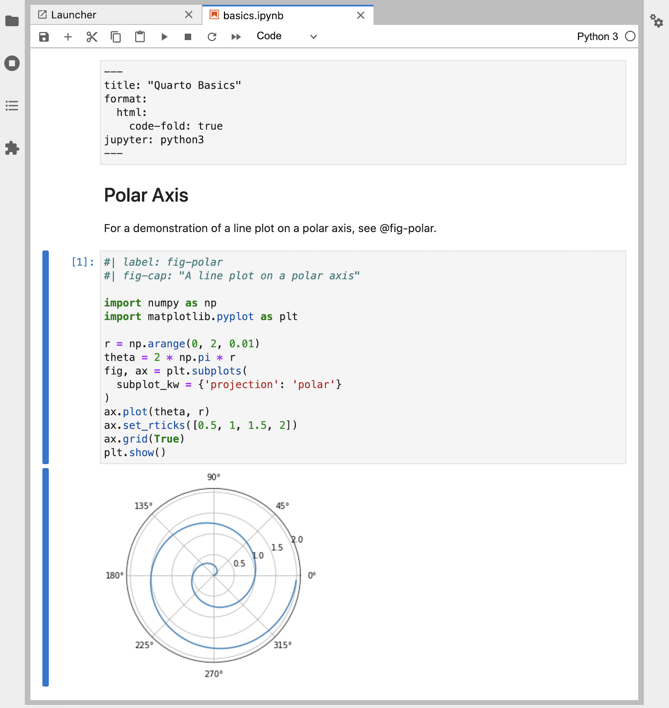
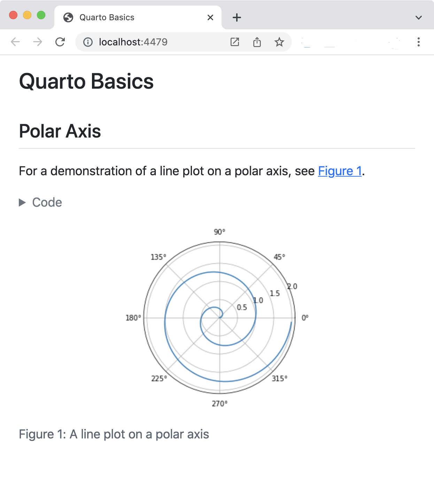
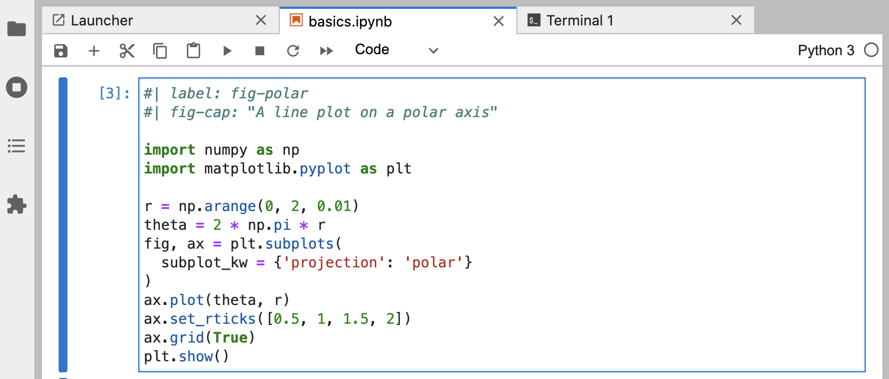

### Overview

In this tutorial we'll show you how to use Jupyter Lab with Quarto. You'll edit code and markdown in Juptyer Lab just as you would with any notebook, and preview the rendered document in a web browser as you work.

Here's how this will look:

{.column-body-outset-right}

The notebook is *rendered* into the HTML version you see on the right (it could have equally been rendered into PDF, MS Word, etc.).

This is the basic model for Quarto publishing---take a source document (in this case a notebook), and render it to a variety of output formats.

Before we get to work, let's verify that Quarto has been installed correctly and that you've got Jupyter available within your Python package library:

``` bash
quarto check jupyter
```

If you don't have Python and/or Jupyter installed, this command will fail with a message letting you know what else is required to use Quarto with Jupyter.

### Rendering

We'll start out by opening a notebook (`polar-axis.ipynb`) in Jupyter Lab and rendering it to a couple of formats. If you want to follow along step-by-step in your own environment, download this notebook:

::: {.callout-note appearance="minimal"}
<i class="bi bi-journal-code"></i> [Download polar-axis.ipynb](_polar-axis.ipynb){download="polar-axis.ipynb"}
:::

Create a new directory to work within and copy the notebook into the directory. If you are using Mac OS X or Linux the following commands will get you setup to start working with the notebook:

``` bash
mkdir -p ~/quarto-tutorial/hello
cd ~/quarto-tutorial/hello
cp ~/Downloads/polar-axis.ipynb .
```

Now, make sure you are in the directory containing `polar-axis.ipynb`, then issue this command to open Jupyter Lab and start working with the notebook:

+-------------------+--------------------------------------------------+
| Platform          | Command                                          |
+===================+==================================================+
| Mac/Linux         |     python3 -m jupyter lab polar-axis.ipynb      |
+-------------------+--------------------------------------------------+
| Windows           |     py -m jupyter lab polar-axis.ipynb           |
+-------------------+--------------------------------------------------+

{.column-body-outset-right}

Create a new Terminal within Jupyter Lab that you'll use for Quarto commands:

{.border .column-body-outset-right}

Now, use the terminal to render the notebook to a couple of formats:

``` bash
quarto render polar-axis.ipynb --to html
quarto render polar-axis.ipynb --to docx
```

If you have a version of LaTeX installed, you can also try rendering to PDF:

``` bash
quarto render polar-axis.ipynb --to pdf
```

::: {.callout-note appearance="simple"}
If you don't have LaTeX installed, we strongly recommend [TinyTeX](https://yihui.org/tinytex/) (an easy to install distribution based on Tex Live). You can install TinyTex with:

``` bash
quarto tools install tinytex
```
:::

### Authoring

The `quarto render` command is used to create the final version of your document for distribution. However, during authoring you'll use the `quarto preview` command. Try it now from the Terminal with `polar-axis.ipynb`:

``` bash
quarto preview polar-axis.ipynb
```

This will render your document and then display it a web browser:

{.border width="600"}

Position Jupyter Lab and the browser preview side-by-side so you can see changes as you work:

{.column-body-outset-right}

Change some of the code, running the changed cell, then save the notebook. You'll see that the preview updates immediately. This is the basic workflow for authoring with Quarto.

### Cell Types

There are few different types of cells in our notebook, let's work a bit with each type.

#### YAML Options

You are likely already familiar with markdown and code cells, but there is a new type of cell ("Raw") that is used for document-level YAML options:

{.border}

Try changing the `code-fold` option to `false`:

``` yaml
format: 
  html:
    code-fold: false
```

Then save the notebook. You'll notice that the code is shown above the plot (where previously it was hidden with a "Code" button that could be used to show it).

#### Markdown Cells

Markdown cells contain raw markdown that will be passed through to Quarto during rendering. You can use any valid Quarto markdown syntax in these cells. Here we specify a header and a cross-reference to the figure created in the code cell below:

{.border}

Try changing the header and saving the notebook---the preview will update with the new header text.

#### Code Cells

Code cells you are of course already familiar with:

{.border}

One new twist are the options you see at the top of the cell (`label` and `fig-cap`). Cell options are written in YAML using a specially prefixed comment (`#|`).

In this example, the cell options are used to make the figure cross-reference-able. Try changing the `fig-cap` and/or the code, running the cell, and then saving the notebook to see the updated preview.

There are a wide variety of cell options that you can apply to tailor your output. We'll delve into these options in the next tutorial.
