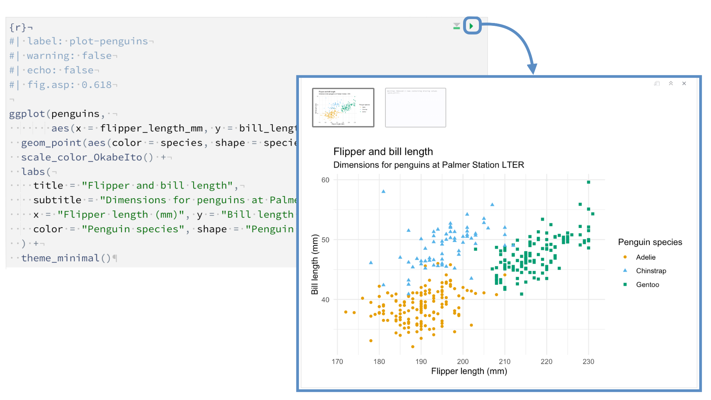

### Overview

In this tutorial we'll show you how to use RStudio with Quarto.
You'll edit code and markdown in RStudio just as you would with any computational document (e.g., R Markdown), and preview the rendered document in the Viewer tab as you work.

The following is a Quarto document with the extension `.qmd` (on the left) along with its rendered version as HTML (on the right).
You could also choose to render it into other formats like PDF, MS Word, etc.

{.column-page-right fig-alt="RStudio IDE with a Quarto document titled \"Hello Quarto!\" open on the left side and a blank viewer pane on the right side."}

{.column-page-right fig-alt="RStudio IDE with a Quarto document titled \"Hello Quarto!\" open on the left side and a blank viewer pane on the right side."}

This is the basic model for Quarto publishing---take a source document (in this case a notebook), and render it to a variety of output formats.
Want to give it a try?
Open it [here](https://rstudio.cloud/project/3519977) on RStudio Cloud and click on Render {width="60"}.

::: callout-note
Remove Cloud link, add source code
:::

### Rendering

Use the {width="60"} (**Render**) button in the RStudio IDE to render the file and preview the output with a single click or keyboard shortcut (⇧⌘K).

If you prefer to automatically render whenever you save you can check the **Render on Save** option on the editor toolbar.
The preview will update whenever you re-render the document.
Side-by-side preview works for both HTML and PDF outputs.

{.column-body-outset-right fig-alt="Top of the editor in the RStudio IDE with \"Render on Save\" checked"}

When rendering, Quarto generates a new file that contains selected text, code, and results from the .qmd file.
The new file can be an [HTML](https://quarto.org/docs/output-formats/all-formats.html), [PDF](https://quarto.org/docs/output-formats/pdf-basics.html), [MS Word](https://quarto.org/docs/output-formats/ms-word.html) document, [presentation](https://quarto.org/docs/presentations/), [website](https://quarto.org/docs/websites/), [book](https://quarto.org/docs/books/), [interactive document](https://quarto.org/docs/interactive/), or [other format](https://quarto.org/docs/output-formats/all-formats.html).

You can also render the document using the functions from the [**quarto**](https://github.com/quarto-dev/quarto-r) package, which provides an R interface to the Quarto CLI:

```{r}
#| eval: false

quarto::quarto_render()
```

### Authoring

The source code (on the left) looks very similar to the rendered output (on the right) since we are viewing the file in the [visual editor](https://rstudio.github.io/visual-markdown-editing/).
Switching to the source editor reveals the plain text source code underlying the document.

::: callout-note
TO DO: Break into two distinct screenshots w/ text headings above to make this even more clear (the current images looks quite a bit like the top image so might be confused for another view of the IDE).
:::

{.column-page-right fig-alt="On the left: Document in the visual editor. On the right: Same document in the source editor."}

Notice that the file contains three types of content.

#### YAML header

An (optional) YAML header surrounded by fences comprised of three dashes (`---`):

{.column-body-outset-right fig-alt="YAML of the of the linked example document titled \"Penguins, meet Quarto!\", with annotation that reads \"YAML\"."}

::: callout-note
TO DO: Add link to other YAML options
:::

#### Code chunks

R code chunks identified with `{r}` with (optional) chunk options, in YAML style, identified by `#|` at the beginning of the line:

{.column-body-outset-right fig-alt="The first code chunk of the of the linked example document titled \"Penguins, meet Quarto!\", with annotation that reads \"Code chunk\"."}

::: callout-note
TO DO: Mention here that other engines are also possible
:::

In addition to rendering the complete document to view the results of code chunks you can also run each code chunk interactively in the RStudio editor by clicking the  icon.
RStudio executes the code and displays the results either inline within your file or in the Console, depending on preferences you can set in the settings menu (gear icon) next to the Render button.

::: callout-note
TO DO: Add gear icon
:::

{.column-body-outset-right fig-alt="Run a code chunk and display output inline" fig-align="center"}

#### Markdown text

Text with formatting, including section headers, hyperlinks, an embedded image, and an inline code chunk:

{.column-body-outset-right fig-alt="Text portion of the of the linked example document titled \"Penguins, meet Quarto!\", with annotation that reads \"Text\"."}

::: callout-note
TO DO: Add narrative on under the hood this is just markdown...
:::

### How it works

When you render a Quarto document, first [knitr](http://yihui.name/knitr/) executes all of the code chunks and creates a new markdown (.md) document which includes the code and its output.
This markdown file generated is then processed by [pandoc](http://pandoc.org/), which creates the finished format.
The Render button encapsulates these actions and executes them in the right order for you.

::: callout-note
TO DO: Update this for Quarto
:::

\
\
