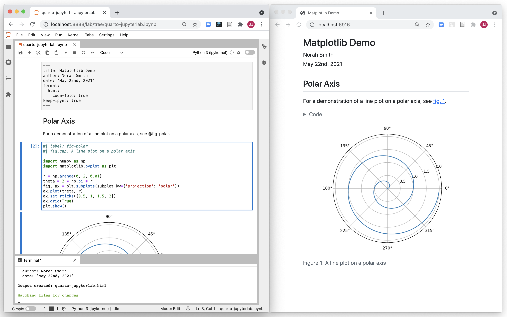

### Overview

In this tutorial we'll show you how to use Jupyter Lab with Quarto. You'll edit code and markdown in Juptyer Lab just as you would with any notebook, and preview the rendered document in a web browser as you work.

Here's how this will look:

{.column-body-outset-right}

The notebook is *rendered* into the HTML version you see on the right (it could have equally been rendered into PDF, MS Word, etc.).

This is the basic model for Quarto publishing---take a source document (in this case a notebook), and render it to a variety of output formats.

### Rendering

\[Download ipynb\]

quarto render notebook.ipynb --to html quarto render notebook.ipynb --to pdf quarto render notebook.ipynb --to docx

Illustration

### Author and Preview

Now preview it -- use a terminal to run `quarto preview`

quarto preview notebook.ipynb

Render it, show the rendered version in a web browser, and update the web browser as a I work.

Start up in Jupyter Lab.

A browser opens with a preview of the document.

Try changing some of the code or even inserting a new cell, then save the notebook, you'll see that the preview updates immediately.

Note that preview works with both HTML and PDF

quarto preview notebook.ipynb --to pdf

### YAML Front Matter

Document wide options

Let's try some. Link to refernece.

### Markdown

Use any quarto markdown

### Code Cells

Let's try some

Show screenshot
