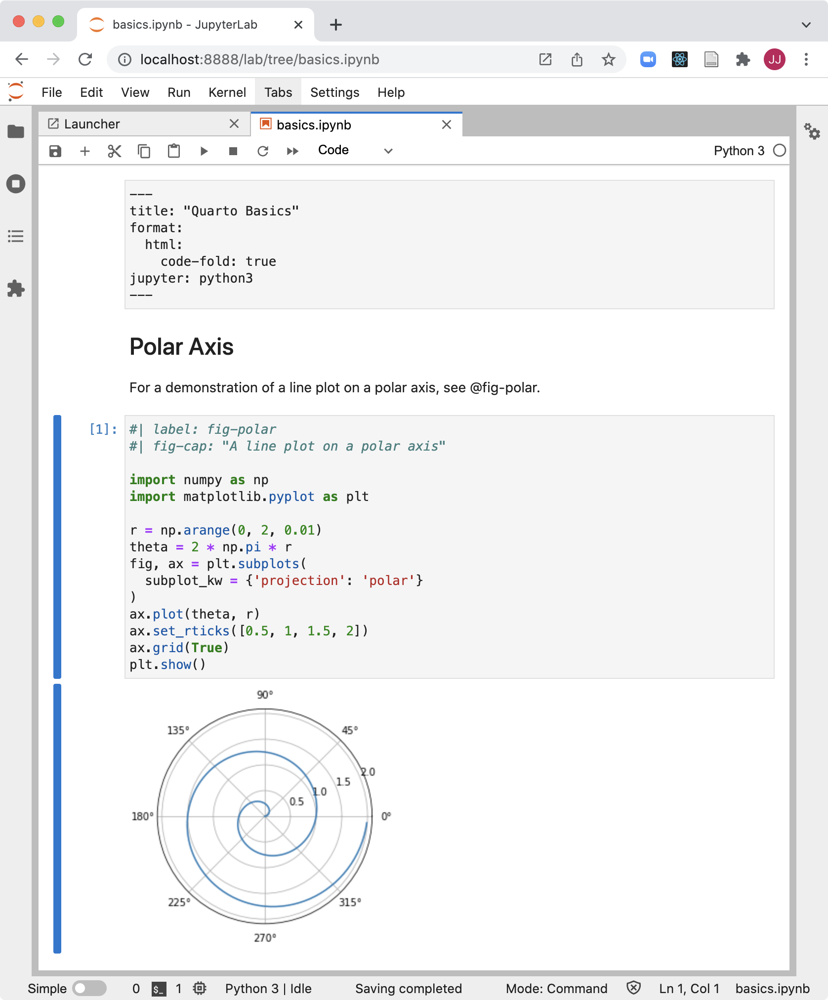

### Overview

In this tutorial we'll show you how to use Jupyter Lab with Quarto. You'll edit code and markdown in Juptyer Lab just as you would with any notebook, and preview the rendered document in a web browser as you work.

Here's how this will look:

{.column-body-outset-right}

The notebook is *rendered* into the HTML version you see on the right (it could have equally been rendered into PDF, MS Word, etc.).

This is the basic model for Quarto publishing---take a source document (in this case a notebook), and render it to a variety of output formats.

### Rendering

We'll start out by opening a notebook in Jupyter Lab and rendering it to a couple of formats. If you want to follow along step-by-step in your own environment, download this notebook:

::: {.callout-note appearance="minimal"}
<i class="bi bi-journal-code"></i> [Download Quarto Basics Notebook](basics.ipynb){download="basics.ipynb"}
:::

Create a new directory to work within and copy the notebook into the directory:

``` bash
mkdir -p ~/quarto-tutorial/basics
cd ~/quarto-tutorial/basics
cp ~/Downloads/basics.ipynb .
```

Now, let's open Jupyter Lab and start working with the notebook:

``` bash
 python3 -m jupyter lab basics.ipynb
```

{.column-body-outset-right}

Create a new Terminal within Jupyter Lab that you'll use for Quarto commands:

{.border .column-body-outset-right}

Now let's render the notebook to a couple of formats:

``` bash
quarto render basics.ipynb --to html
quarto render basics.ipynb --to docx
```

If you want to try rendering to PDF, install `tinytex` (a LaTeX distribution) then use `--to pdf`:

``` bash
quarto tools install tinytex
quarto render basics.ipynb --to pdf
```

Note that if you already have LaTeX installed that will work fine too (no need to install TinyTeX).

### Authoring

The `quarto render` command is used to create the final version of your document for distribution. However, during authoring you'll use the `quarto preview` command. Try it now from the Terminal with `basics.ipynb`:

``` bash
quarto preview basics.ipynb
```

This will render your document and then display it a web browser:

{.border width="500"}

Position Jupyter Lab and the browser preview side-by-side so you can see changes as you work:

{.column-body-outset-right}

Change some of the code, running the changed cell, then save the notebook. You'll see that the preview updates immediately. This is the basic workflow for authoring with Quarto.

### Cell Types

There are few different types of cells in our notebook, let's work a bit with each type.

#### YAML Options

You are likely already familiar with markdown and code cells, but there is a new type of cell ("Raw") that is used for document-level YAML options:

{.border .column-body-outset-right}

Try changing the `code-fold` option to `true`:

``` yaml
format: 
  html:
    code-fold: true
```

Then save the notebook. You'll notice that the code is shown above the plot (where previously it was hidden with a "Code" button that could be used to show it).

#### Markdown Cells

Markdown cells contain raw markdown that will be passed through to Quarto during rendering. You can use any valid Quarto markdown syntax in these cells. Here we specify a header and a cross-reference to the figure created in the code cell below:

{.border .column-body-outset-right}

Try changing the header and saving the notebook---the preview will update with the new header text.

#### Code Cells

Code cells you are of course already familiar with:

{.border .column-body-outset-right}

One new twist are the options you see at the top of the cell (`label` and `fig-cap`). In this example, these options are used to make the figure cross-reference-able. It's not important to understand the details of cross references now, just know that there are variety of cell options that you can apply to tailor your output.

Try changing the `fig-cap` and/or the code, running the cell, and then saving the notebook to see the updated preview.
