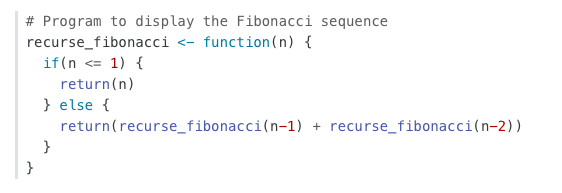
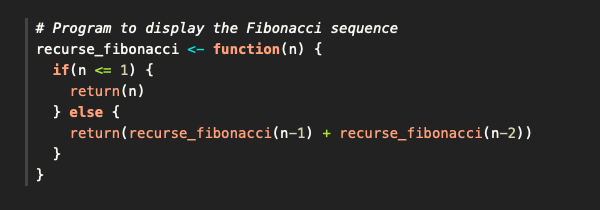

## Table of Contents

Use the `toc` option to include an automatically generated table of contents in the output document. Use the `toc-depth` option to specify the number of section levels to include in the table of contents. The default is 3 (which means that level-1, 2, and 3 headings will be listed in the contents). For example:

``` {.markdown}
toc: true
toc-depth: 2
```

Note that HTML documents implement support for floating the table of contents to the right of the page. See the [Floating TOC](../output-formats/html-bootstrap.md#floating-toc) documentation for additional details.

You can customize the title used for the table of contents using the `toc-title` option:

``` {.yaml}
toc-title: Contents
```

If you want to exclude a heading from the table of contents, add both the `.unnumbered` and `.unlisted` classes to it:

``` {.markdown}
### More Options {.unnumbered .unlisted}
```

## Section Numbering

Use the `number-sections` option to number section headings in the output document. For example:

``` {.yaml}
number-sections: true
```

Use the `number-depth` option to specify the deepest level of heading to add numbers to (by default all headings are numbered). For example:

``` {.yaml}
number-depth: 3
```

To exclude an individual heading from numbering, add the `.unnumbered` class to it:

``` {.markdown}
### More Options {.unnumbered}
```

## Syntax Highlighting

Pandoc will automatically highlight syntax in [fenced code blocks](https://pandoc.org/MANUAL.html#fenced-code-blocks) that are marked with a language name.

You can specify the code highlighting style using `highlight-style` and specifying one of the supported themes. Supported themes include: arrow, pygments, tango, espresso, zenburn, kate, monochrome, breezedark, haddock, atom-one, ayu, breeze, dracula, github, gruvbox, monokai, nord, oblivion, printing, radical, solarized, and vim.

For example:

``` {.yaml}
highlight-style: github
```

Highlighting themes can provide either a single highlighting definition or two definitions, one optimized for a light colored background and another optimized for a dark color background. When available, Quarto will automatically select the appropriate style based upon the code chunk background color's darkness. You may may always opt to specify the full name (e.g. `atom-one-dark`) to bypass this automatic behavior.

By default, code is highlighted using the `arrow` theme, which is optimized for accessibility. Here are examples of the `arrow` light and dark themes:

::: {.tabset}
#### Light



#### Dark


:::
