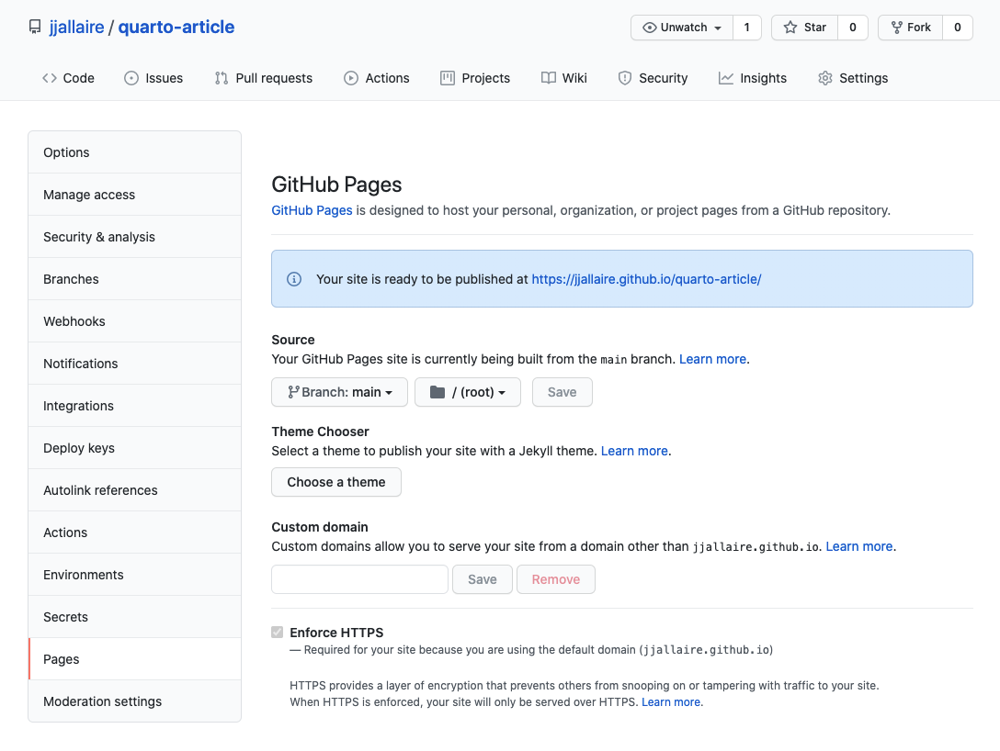
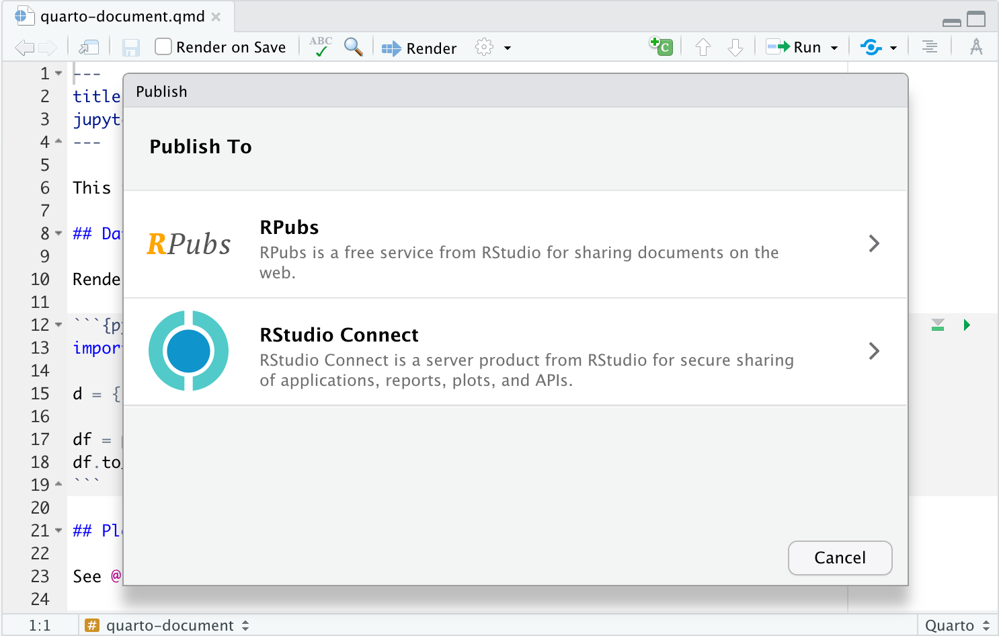

This article covers the various ways you can publish Quarto HTML documents, including:

-   Using [GitHub Pages] to host your article on GitHub

-   Publishing to [RPubs](#rpubs-and-rsc) and [RStudio Connect](#rpubs-and-rsc).

-   Sharing a standalone HTML file using E-mail, Dropbox, etc.

Note that it's also possible to publish collections of Quarto documents as a website (see the article on [publishing websites](../websites/publishing-websites.md) for additional details).

## GitHub Pages

[GitHub Pages](https://pages.github.com/) is a service that lets you publish a website from any GitHub repository. While the service supports publishing full websites, it's also a perfectly suitable place to publish a single Quarto document.

Here are the steps required to publish a Quarto article to GitHub Pages:

1)  Create a new Git repository that will be used to host your article.

2)  Configure your repository to publish the contents of the `main` branch (you can do this from the *Pages* section of your repository settings:

    {.border}

    Note that the **Source** is set to the root directory of the `main` branch.

3)  Create a Quarto document named `index.qmd` within the repository (using this name will allow your article to be served as the default web page for the repository).

4)  Write and render your article using Quarto.

5)  Push the article (including the HTML file generated when you rendered it) to GitHub. Your article is now published!

GitHub Pages are served on the `github.io` domain (with your GitHub account as a sub-domain). For example, if your GitHub username is `jsmith` and your repository is named `quarto-article` then the article will be available at <https://jsmith.github.io/quarto-article>.

## RPubs & RStudio Connect {#rpubs-and-rsc}

[RPubs](https://rpubs.com/) is a free service from RStudio for sharing documents on the web. [RStudio Connect](https://www.rstudio.com/products/connect/) is a server product from RStudio for secure sharing of applications, reports, and plots.

Note that all documents published to RPubs are publicly visible, so you should only publish content you want to share publicly. Unlike RPubs, RStudio Connect is a server that you run inside an organization, so is suitable for publishing content that you only want visible within your organization's network.

You can publish Quarto documents using the `quarto_publish_doc()` function from the R quarto package. For example, here we publish a document to both RPubs and an RStudio Connect server:

``` {.r}
library(quarto)
quarto_publish_doc("mydoc.qmd", server = "rpubs.com")
quarto_publish_doc("mydoc.qmd", server = "rsc.example.com")
```

Note that once you've published a document to a particular server you can omit the `server` argument when updating the document:

``` {.r}
quarto_publish_doc("mydoc.qmd")
```

You can also publish to RPubs and RStudio Connect directly from within RStudio. To do this, just click the Publish button <kbd>{width="21"}</kbd> on the editor toolbar or preview window:



Note that you should be running the [daily build](https://dailies.rstudio.com) of RStudio (version 1.5.184 or higher) if you want to publish Quarto documents. Note that the daily build has many other Quarto related enhancements so is highly recommended even if you aren't using the publishing features.

## Standalone HTML

You can optionally render Quarto documents into `self-contained` HTML, whereby all of the content required to render the article (images generated by plots, required CSS and JavaScript, etc.) are bundled into a single HTML file. Use the `self-contained` option to do this:

``` {.yaml}
format:
   html:
     self-contained: true
```

Then, you can share this HTML file using the same means you use to share other document types like spreadsheets, presentations, and PDFs (e.g by uploading it to Dropbox or any other file sharing service).

## Other Services

Note that any web server or web host capable of hosting a static website can equally well host a single Quarto HTML document. See the article on publishing websites for details on publishing articles on a variety of other services including [Netlify](../websites/publishing-websites.md#netlify), [Firebase](../websites/publishing-websites.md#firebase), [Site44](../websites/publishing-websites.md#site44), and [Amazon S3](../websites/publishing-websites.md#amazon-s3).
