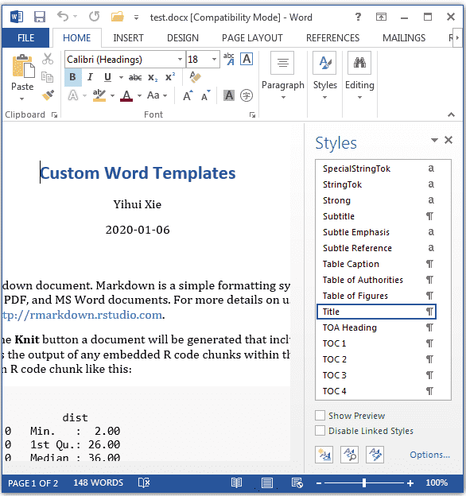

## Overview

Use the `docx` format to create MS Word output. For example:

``` {.yaml}
---
title: "My Document"
format:
  docx:
    toc: true
    section-numbers: true
    highlight-style: github
```

This example highlights a few of the options available for MS Word output. This document covers these and other options in detail.

```{.include}
_document-options-begin.md
```

## Templates

If you want to customize the appearance of MS Word output, Pandoc supports a special type of template called a *reference document*. Here's an example of specifying a custom reference document for `docx`:

``` {.yaml}
format:
  docx:
    custom-reference-doc.docx
```

Reference documents include sample text that uses all of the output styles used by Pandoc. To create a new reference doc based on the Pandoc default, execute the following command:

    $ pandoc -o custom-reference-doc.docx --print-default-data-file reference.docx

Then, open `custom-reference-doc.docx` in MS Word and modify styles as you wish:



When you move the cursor to a specific element in the document, an item in the styles list will be highlighted. If you want to modify the style of any type of element, you can click the drop-down menu on the highlighted item, and you will see a dialog box like this:


After you finish modifying the styles, you can save the document and use it as the template for future Word documents.
