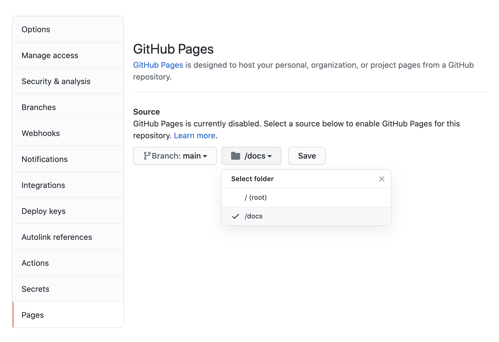
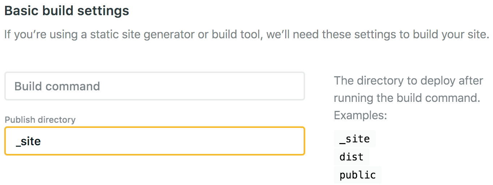

## Overview

There are a wide variety of ways to publish Quarto websites. Website content is by default written to the `_site` sub-directory (you can customize this using the `output-dir` option). Publishing is simply a matter of copying the output directory to a web server or web hosting service.

Below we describe several convenient options for Quarto website deployment including [GitHub Pages], [Netlify], [RStudio Connect], [Firebase](#google-firebase), [Site44], and [Amazon S3]. We'll mostly defer to the documentation provided by the various services, but will note any Quarto website specific configuration required.

## Rendering for Publish

The most important thing you should be sure to do before publishing is a final render of your project:

``` {.bash}
quarto render
```

If you are publishing a [book](../books/book-basidcs.md) you'll want to add the `--to all` argument to ensure that all output formats (e.g. PDF, EPUB) have up to date content:

``` {.bash}
quarto render --to all
```

This is particularly important to remember because incremental changes you make when using the [development server](website-basics.md#workflow) aren't rendered into the output directory. To ensure that your output is up to date before publishing you should always do a full `quarto render`.

## GitHub Pages

[GitHub Pages](https://pages.github.com/) is a service that lets you publish a website from any GitHub repository. There are a few configuration steps required to host a Quarto website using GitHub Pages:

1.  Create a file named `.nojekyll` in your repository (this is required to disable some processing of HTML files that GitHub does by default). You can do this with the following:

    ``` {.bash}
    touch .nojekyll
    ```

2.  Set the `output-dir` within your `_quarto.yml` project file to "docs":

    ``` {.yaml}
    project:
      type: site
      output-dir: docs
    ```

3.  Configure your gh-pages to serve content from the "docs" directory:

    {.border width="95%"}

See the [GitHub Pages](https://pages.github.com/) documentation for additional details on creating and deploying websites with GitHub.

## Netlify

[Netlify](https://www.netlify.com/) is a popular website hosting service that allows for both direct upload of website files or integrated publishing from Git repositories (GitHub, GitLab, or Bitbucket) via commit-hooks.

If you are using Netlify Git integration, be sure to set the publish directory to the output directory of your website (`_site` by default but modifiable via the `output-dir` metadata value). For example:

{.screenshot width="95%"}

## RStudio Connect

[RStudio Connect](https://www.rstudio.com/products/connect/) is a server product from RStudio for secure sharing of websites, applications, reports, and plots.

You can deploy a Quarto website to RStudio Connect from the command line using the `quarto_publish_site()` function from the R quarto package. For example:

``` {.r}
library(quarto)
quarto_publish_site(server = "https://rsc.example.com")
```

Note that once you've published your site for the first time you can omit the `server` argument:

``` {.r}
quarto_publish_site()
```

Unlike the other website publishing options described here, [RStudio Connect](https://www.rstudio.com/products/connect/) is a server that you run inside an organization, so is suitable for publishing content that you only want visible within your organization's network as opposed to visible to the entire internet.

## Google Firebase {#google-firebase}

Google Firebase has a [web hosting service](https://firebase.google.com/docs/hosting/quickstart) that enables easy deployment of websites using a set of command line tools.

Firebase websites by default deploy content from the `public` directory of the Firebase project directory. This means that you should set the `output-dir` to `"public"` within `_quarto.yml`:

``` {.yaml}
project:
  type: site
  output-dir: public
```

## Site44 (Dropbox)

[Site44](https://www.site44.com/) is a service that allows you to publish websites from within Dropbox folders. Site44 creates a `Dropbox/Apps/site44` directory, and any folders within that directory are published as websites.

The recommended workflow for deploying Distill websites to Site44 is to develop your website in a separate project directory, and then, when it's ready for final publishing, copy the contents of the `_site` directory to the folder for your website.

## Amazon S3

If you are a user of Amazon Web Services you can serve your website directly from Amazon S3. Note however that this option is a bit more technically involved than GitHub Pages, Netlify, or Site 44. See the article on [Hosting a Static Website on Amazon S3](https://docs.aws.amazon.com/AmazonS3/latest/dev/WebsiteHosting.html) for additional details.

## Other services

Any web server or web host can be used to deploy a Distill website. Here's a recent [CNET roundup](https://www.cnet.com/web-hosting/) of other web hosts you could consider. You can also deploy a Distill website on any internal (intranet) web server.
