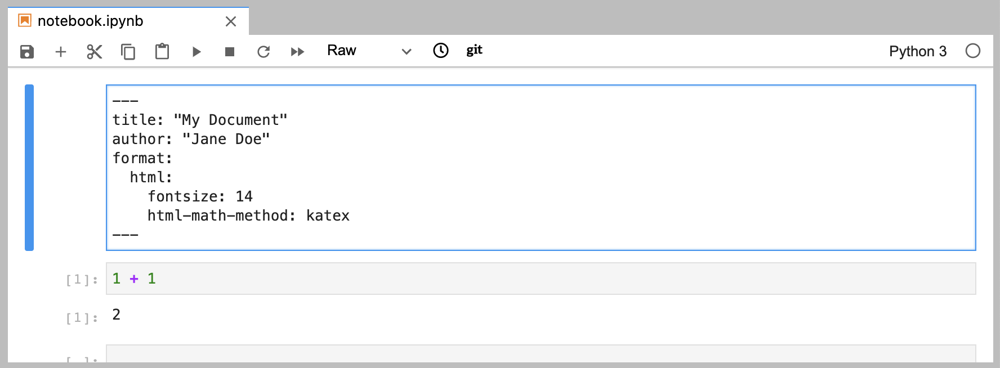

## Overview

If you have an existing Jupyter Notebook (.ipynb file) that you want to export to one of the formats supported by Pandoc, you can do this using `quarto render`. For example:

``` bash
$ quarto render notebook.ipynb # html by default
$ quarto render notebook.ipynb --to pdf
$ quarto render notebook.ipynb --to docx
```

By default, Quarto will not re-execute the code cells in the notebook. If you want to execute code cells during render, specify the `--execute` flag. For example:

``` bash
$ quarto render notebook.ipynb --execute
```

## Export Options

There are dozens of options that you can use to customize exported output. You can specify these options by adding a raw YAML block at the top of your notebook:



Alternatively, you can keep these options in a separate YAML file and reference this file using the `--metadata-file` command line argument. For example:

``` bash
$ quarto render notebook.ipynb --metadata-file options.yml
```

See the [Basic Usage](basic-usage.html) article to learn more about the various metadata options that can be used to customize output.
