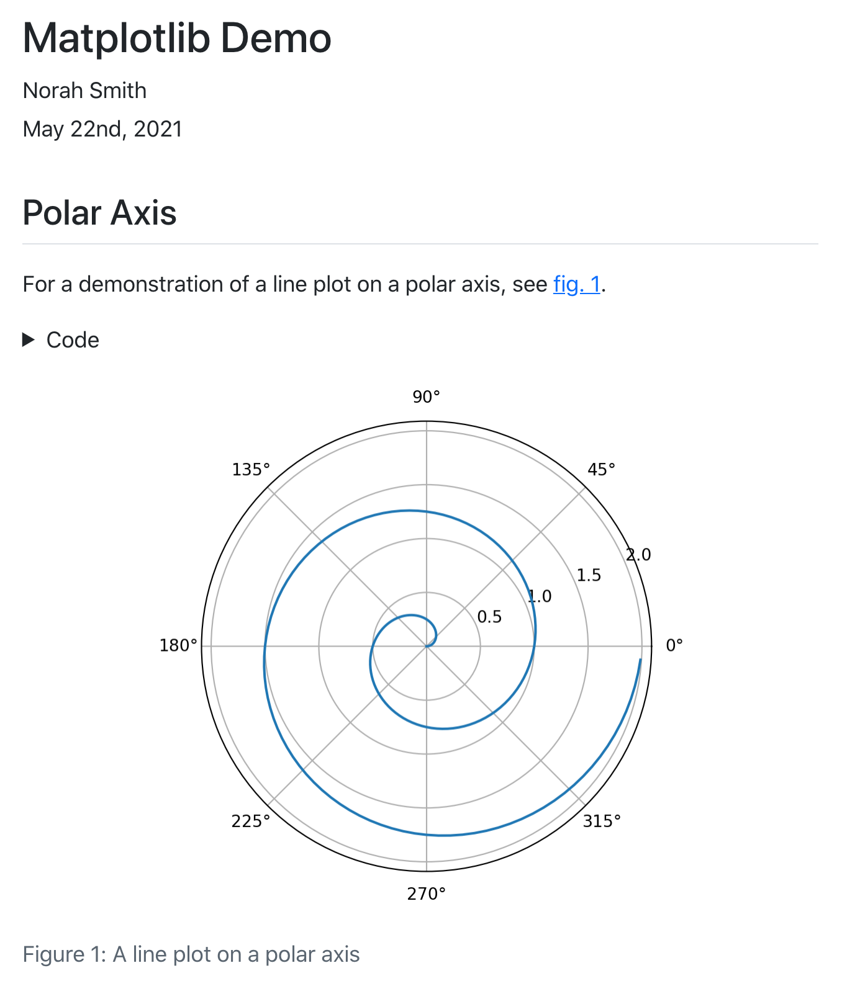

## Introduction

Quarto is an open-source scientific and technical publishing system built on [Pandoc](https://pandoc.org). Quarto documents are authored using [markdown](https://en.wikipedia.org/wiki/Markdown), an easy to write plain text format.

In addition to the core capabilities of Pandoc, Quarto includes:

1.  Support for embedding output from Python, R, and Julia via integration with [Jupyter](https://jupyter.org/) and [Knitr](https://yihui.org/knitr/) .

2.  A variety of extensions to Pandoc markdown useful for technical writing including callouts (admonitions), cross-references, sub-figures, layout panels, hover-able citations and footnotes, and more.

3.  A project system for rendering groups of documents at once, sharing options across documents, and producing aggregate output like [books](docs/books/book-basics.md) and [websites](docs/websites/website-basics.md).

4.  HTML output based on [Bootstrap](https://getbootstrap.com/) (including support for [Bootswatch](https://bootswatch.com/) themes).

5.  Automatic installation of required LaTeX packages when rendering PDF output.

The overall design of Quarto is influenced heavily by [R Markdown](https://rmarkdown.rstudio.com/), however unlike R Markdown the architecture is language agnostic. In it's current iteration, Quarto can render plain markdown, Jupyter Notebooks, and Knitr (Rmd) documents..

## Hello, Quarto

Here's a simple example of a markdown document that includes a cross-referenced figure generated by [Matplotlib](https://matplotlib.org/):

```` {.python}
---
title: "Matplotlib Demo"
author: "Norah Smith"
date: "May 22nd, 2021"
format: 
  html:
    code-fold: true
---

## Polar Axis

For a demonstration of a line plot on a polar axis, see @fig-polar.

```{python}
#| label: fig-polar
#| fig.cap: "A line plot on a polar axis"

import numpy as np
import matplotlib.pyplot as plt

r = np.arange(0, 2, 0.01)
theta = 2 * np.pi * r
fig, ax = plt.subplots(subplot_kw={'projection': 'polar'})
ax.plot(theta, r)
ax.set_rticks([0.5, 1, 1.5, 2])
ax.grid(True)
plt.show()
```
````

Here's what the document looks like when rendered by Quarto:

{.border}

You can render documents using the `quarto` command line tool:

``` {.bash}
$ quarto render matplotlib-demo.md
```

Embedded code blocks (in this case some Python code that generates a plot) are run by Quarto, and their output is included in the final document generated by Pandoc.

Don't worry if all the mechanics of this example aren't obvious, the main takeaway is that Quarto enables you to enhance [Pandoc markdown](https://pandoc.org/MANUAL.html#pandocs-markdown) documents with features useful for scientific and technical communication including executable code, cross-references, and much more.

::: {.callout-note}
While this example demonstrates rendering an ordinary markdown file, Quarto can also be used just the same with other input formats like Jupyter Notebooks (.ipynb) and R Markdown documents (.Rmd).
:::

## Getting Started

[Installation](docs/getting-started/installation.md) will get you up and running with Quarto (including additional dependencies required for computational documents).

[Quarto Basics](docs/getting-started/quarto-basics.md) will help you learn the core mechanics of rendering markdown from the command line as well as how to specify document formats and options.

[Executing Code](docs/computations/executing-code.md) covers creating computational documents with Quarto in more depth, including how to use Quarto with [JupyterLab](docs/computations/using-jupyter-lab.md) and [RStudio](docs/computations/using-rstudio.md).
