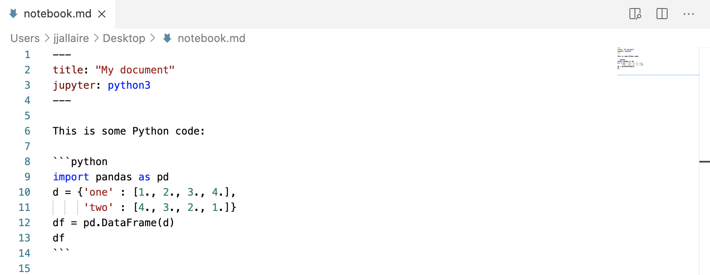

## Introduction

To author dynamic Jupyter documents for Quarto, you use [Jupyter Markdown](https://jupytext.readthedocs.io/en/latest/formats.html#jupytext-markdown), which is a pure markdown representation of a Jupyter Notebook. Markdown notebooks are easier to use with version control nand can be edited in your favorite markdown editor.

Jupyter Markdown is just standard markdown with a `jupyter` YAML metadata option to specify which kernel to use, and one or more code blocks to be executed:



You can render Jupyter Markdown using this command:

``` {.bash}
$ quarto render notebook.md
```

You can also use Quarto to export conventional Jupyter Notebooks (.ipynb files). See the article on [Exporting Notebooks](exporting-notebooks.html) for additional details.

## Requirements

Before working with Jupyter Markdown, you should ensure that you have the required packages installed for your particular Jupyter kernel.

### Python

If you already have Python/Jupyter installed in your environment, then you should have everything required to render Jupyter notebooks with Python kernels.

If you are in a fresh environment, install the core Quarto minimal requirements (as shown below) or if you like install the full `jupyter` package including the notebook, qtconsole, etc.:

``` {.shell}
# quarto minimal requirements
$ pip install jupyter_core nbformat nbclient ipykernel

# full jupyter install
$ pip install jupyter
```

### Julia

If you are using Julia, please see the [IJulia documentation](https://github.com/JuliaLang/IJulia.jl) on installing and using the Julia kernel.

Note that it's also strongly recommended that you use [Revise.jl](https://timholy.github.io/Revise.jl/stable/) to optimize away kernel startup time. See the documentation on [using Revise within Jupyter](https://timholy.github.io/Revise.jl/stable/config/#Using-Revise-automatically-within-Jupyter/IJulia-1) for additional details.

## Rendering

You can use Quarto to convert Jupyter Markdown to HTML, PDF, Word, or any of the over 40 Pandoc [output formats](https://pandoc.org/). To render a document, just provide it as an argument to `quarto render`:

``` {.bash}
$ quarto render notebook.md # will render to html
$ quarto render notebook.md --to pdf
$ quarto render notebook.md --to docx
```

During rendering your Jupyter Markdown file will be converted into a notebook file (.ipynb) and then executed using the Jupyter kernel. By default, this file is considered temporary and removed after render. If you wish to keep it, specify the `keep-ipynb` option:

``` {.yaml}
---
title: "My document"
keep-ipynb: true
jupyter: python3"
---
```

See the [Basic Usage](basic-usage.html) article for details on how to specify Pandoc output format options.

See the [Jupyter Options](jupyter-options.html) article to learn how to set options for:

1.  Whether code is hidden, shown, or folded.
2.  How to treat warnings and errors in output.
3.  Specifying the size, alignment, and captions for figures.
4.  Declaring render-time notebook parameters
5.  Whether intermediate files (e.g. .md, .tex, and .ipynb) are preserved.

## Jupyter Cache

If cells are time-consuming to render, you can speed things up by using [Jupyter Cache](https://jupyter-cache.readthedocs.io/en/latest/). To do this, first install the `jupyter-cache` package:

``` {.bash}
$ pip install jupyter-cache
```

Then, add the `cache` YAML metadata option:


The cache will be used whenever the content for the notebook's code cells remains the same.

You can do a render without the cache or force re-population of the cache using command line arguments:

``` {.bash}
$ quarto render notebook.md --no-cache
$ quarto render notebook.md --refresh-cache
```

## Jupytext

Jupytext enables you to have multiple synchronized representations of a notebook (e.g. .ipynb and .md). To learn more about using Jupytext see the [project documentation](https://jupytext.readthedocs.io/en/latest/install.html).

If you render a document that has Jupytext synchronization enabled, Quarto will automatically call `jupytext —-sync` as required. For example:

``` {.bash}
$ quarto render notebook.md
[jupytext] Syncing ipynb,md...Done

Executing 'notebook.ipynb'
  Cell 1/2...Done
  Cell 2/2...Done
```

## Learning More

See the [Basic Usage](basic-usage.html) article for details on how to specify Pandoc output format options.

See the [Jupyter Options](jupyter-options.html) article to learn how to customize rendering output (figures, visibility of code, etc.) and kernel execution.

You can also use Quarto to export conventional Jupyter Notebooks (.ipynb files). See the article on [Exporting Notebooks](exporting-notebooks.html) for additional details.
